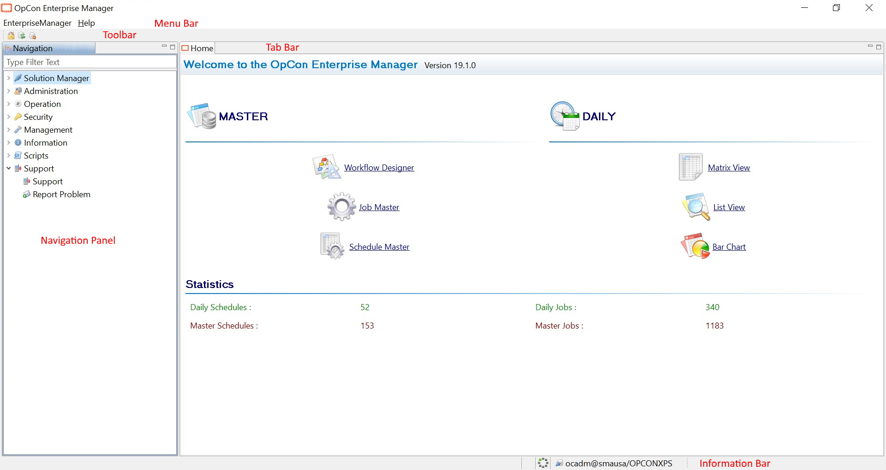

# Understanding the User Interface Layout

**Theme:** Overview  
**Who Is It For?** System Administrator, Automation Engineer

## What Is It?

When the Enterprise Manager first opens, it displays the Home screen. The top shows the installed Enterprise Manager version number. The bottom shows the count of schedules and jobs in both the Daily and Master tables. The left side (the Navigation Panel) provides navigation topics, and the center provides links to frequently used topics.

The Enterprise Manager screen layout includes:

- [Menus](Menus.md)
- [Navigation Panel](Navigation-Panel.md)
- [Information Bar](Information-Bar.md)
- [Keyboard Shortcuts](Keyboard-Shortcuts.md)

## Configuration Options

| Setting | What It Does | Default | Notes |
|---|---|---|---|
## FAQs

**Q: What does Understanding the User Interface Layout do?**

When the Enterprise Manager first opens, it displays the Home screen. The top shows the installed Enterprise Manager version number. The bottom shows the count of schedules and jobs in both the Daily 

**Q: Where can you find Understanding the User Interface Layout in OpCon?**

Access Understanding the User Interface Layout through the appropriate section in the Enterprise Manager or Solution Manager navigation.

## Glossary

**Enterprise Manager (EM)**: OpCon's rich client graphical user interface for Windows and Linux, used to define schedules and jobs, manage automation data, and perform operational tasks.

**Solution Manager**: OpCon's browser-based graphical user interface for managing automation data, performing operational actions, and administering the system.

**Master Tables**: The OpCon database tables that hold the permanent definitions of schedules and jobs. Changes to master tables affect all future schedule builds.

**Resource**: A numeric variable in OpCon representing a finite pool. Jobs can be configured to require a set number of resource units to run, limiting concurrent executions and preventing resource contention.

**Schedule**: A named container for jobs in OpCon, built for a specific date to create that day's automation. Schedules define build settings, frequencies, and the jobs that run within them.

**Job**: The fundamental unit of work in OpCon. A job defines what to run, on which machine, when to start, and what conditions must be met. Job results are tracked and can trigger events and notifications.

**OpCon**: Continuous' workflow automation platform. The OpCon server includes the database, SAM and Supporting Services (SAM-SS), and graphical user interfaces. agents installed on target platforms run jobs and report results.
