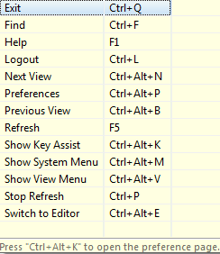

# Keyboard Shortcuts

**Theme:** Configure  
**Who Is It For?** System Administrator, Automation Engineer

## What Is It?

Enterprise Manager supports keyboard shortcuts that speed up navigation and common tasks. Shortcuts are available at the application level (such as F1 for help) and within individual views and editors.

## When Would You Use It?

- You need to configure or manage Keyboard Shortcuts in OpCon

## Why Would You Use It?

- **Centralized control**: Managing Keyboard Shortcuts through OpCon provides consistent oversight and a full audit trail for all changes

## Enterprise Manager

Press **F1** to open contextual help for the current location. From the main screen, this opens the first page of the Enterprise Manager Guide.

The following shortcuts are available from the Enterprise Manager banner:

||||
|--- |--- |--- |
||Logout|Ctrl+L (confirm logout)|
||Logout|Ctrl+Q (automatic logout)|
||Refresh|F5|
||Pause Refresh|Ctrl+P|

Press **Ctrl+Alt+K** (Show Key Assist) to display the shortcut menu:

The following **Ctrl+Alt+** shortcuts access the *Preference* and *System* menus and switch between views:

|||
|--- |--- |
|Ctrl+Alt+B|Go to previous views when multiple views are open|
|Ctrl+Alt+E|Switch between editors when multiple editors are open|
|Ctrl+Alt+K|Display the list of shortcuts *- or -* within the Help menu, select Show Key Assist|
|Ctrl+Alt+M|Display the system menu for the current view/editor|
|Ctrl+Alt+N|Go to the next view when multiple views are open|
|Ctrl+Alt+P|Go to the Preferences screen|
|Ctrl+Alt+V|Display the View menu|

## Schedule Master and Job Master

The following **Alt +** and **Ctrl +** shortcuts access required fields in *Schedule Master* and *Job Master* editors:

||||
|--- |--- |--- |
||Alt+N|Go to the Name field|
||Ctrl+N|Add|
||Ctrl+R|Cancel|
||Ctrl+Insert|Copy|
||Ctrl+F|Find|
||Ctrl+D|Remove|
||Ctrl+S|Save|

## Frequency

|||
|--- |--- |
|Alt+A|Add|
|Alt+R|Remove|
|Alt+E|Edit|
|Alt+F|Forecast|
|Alt+C|Forecast All|
|Alt+D|Advanced|

## Events

|||
|--- |--- |
|Alt+A|Add|
|Alt+R|Remove|
|Alt+E|Edit|
|Alt+J|Select Job Related Events|
|Alt+F|Select Frequency Related Events|

## Threshold/Resource Update

|||
|--- |--- |
|Alt+A|Add|
|Alt+R|Remove|
|Alt+E|Edit|
|Alt+J|Select Job Related T/R|
|Alt+F|Select Frequency Related T/R|

## Dependencies

|||
|--- |--- |
|Alt+A|Add|
|Alt+R|Remove|
|Alt+E|Edit|
|Alt+J|Select Job Related option|
|Alt+F|Select Frequency Related option|

## General Job Details

|||
|--- |--- |
|Alt+P|Go to Primary Machine field|
|Alt+G|Go to Machine Group Selection field|

## BIS Details

|||
|--- |--- |
|Alt+R|Go to Run ID field|

## Container Details

|||
|--- |--- |
|Alt+S|Go to SubSchedule selection field|

## File Transfer Details

|||
|--- |--- |
|Alt+S|Go to Source Machine field|
|Alt+D|Go to Destination Machine field|
|Alt+P|Select/clear Fail if preferred settings not satisfied option|
|Alt+T|(Options tab) Go to the Source Data Type Field|

## IBM i Details

|||
|--- |--- |
|Alt+J|(Job Information tab) Go to Job Type field|
|Alt+C|(Call Information Tab) Go to Call field|
|Alt+A|(Messages Tab) Go to Add button|
|Alt+R|(Messages Tab) Go to Remove button|
|Alt+U|(Messages Tab) Go to Update button|
|Alt+A|(Spool Files Tab) Go to Add button|
|Alt+R|(Spool Files Tab) Go to Remove button|
|Alt+U|(Spool Files Tab) Go to Update button|

## MCP Details

|||
|--- |--- |
|Alt+F|Go to File Title in Job Details|
|Alt+T|Go to File Title in Pre-Run Details|
|Alt+C|Go to Fail Codes in Failure Criteria|

## OS 2200 Details

|||
|--- |--- |
|Alt+Q|Go to Qualifier field in Start Command|

## SAP BW Details

|||
|--- |--- |
|Alt+C|Go to Process Chain Name field|

## SAP R/3 Details

|||
|--- |--- |
|Alt+J|Go to Job Name field|
|Alt+W|Go to New button|
|Alt+E|Go to Edit button|

## UNIX Details

|||
|--- |--- |
|Alt+S|Go to Start Image field|

## Windows Details

|||
|--- |--- |
|Alt+U|Go to User ID field|

## z/OS Details

|||
|--- |--- |
|Alt+J|Go to z/OS Job Type field|

## Calendars

|||
|--- |--- |
|Alt+N|Go to Name field|

## Global Properties

|||
|--- |--- |
|Alt+N|Go to Name field|

## Thresholds

|||
|--- |--- |
|Alt+N|Go to Name field|

## Resources

|||
|--- |--- |
|Alt+N|Go to Name field|

## Machines

|||
|--- |--- |
|Alt+N|Go to Name field|
|Alt+S|Go to Socket Number field|

## Machine Groups

|||
|--- |--- |
|Alt+N|Go to Name field|
|Enter Key|Move a selected item between Unassigned and Assigned|

## Server Options

|||
|--- |--- |
|Alt+U|Go to Update button|
|Alt+D|Go to Defaults button|

## Roles

|||
|--- |--- |
|Alt+N|Go to Name field|
|Enter Key|Move a selected item between Revoked and Granted|

## User Accounts

|||
|--- |--- |
|Alt+N|Go to Name field|
|Enter Key|Move a selected item between Revoked and Granted|

## Batch Users

|||
|--- |--- |
|Alt+S|Go to Select Target OS field|

## Departments

|||
|--- |--- |
|Alt+N|Go to Name field|

## Access Codes

|||
|--- |--- |
|Alt+N|Go to Name field|

## Access Code Privileges

|||
|--- |--- |
|Alt+U|Go to Allow Job Updates field|
|Enter Key|Move a selected item between Revoked and Granted|

## Schedule Privileges

|||
|--- |--- |
|Enter Key|Move a selected item between Revoked and Granted|

## Function Privileges

|||
|--- |--- |
|Enter Key|Move a selected item between Revoked and Granted|

## Departmental Function Privileges

|||
|--- |--- |
|Enter Key|Move a selected item between Revoked and Granted|

## Batch User Privileges

|||
|--- |--- |
|Enter Key|Move a selected item between Revoked and Granted|

## Machine Privileges

|||
|--- |--- |
|Alt+U|Go to Allow Job Updates field|
|Enter Key|Move a selected item between Revoked and Granted|

## Machine Group Privileges

|||
|--- |--- |
|Alt+U|Go to Allow Job Updates field|
|Enter Key|Move a selected item between Revoked and Granted|

## Configuration Options

| Setting | What It Does | Default | Notes |
|---|---|---|---|
## FAQs

**Q: What does Keyboard Shortcuts cover?**

This page covers Enterprise Manager, Schedule Master and Job Master, Frequency.

## Glossary

**Enterprise Manager (EM)**: OpCon's rich client graphical user interface for Windows and Linux, used to define schedules and jobs, manage automation data, and perform operational tasks.

**Frequency**: A set of rules that defines when a job or schedule is eligible to run, based on calendar rules, day-of-week settings, period offsets, and other timing criteria.

**Threshold**: A numeric variable stored in the OpCon database used to control job execution. Jobs can be made dependent on threshold values, and OpCon events can update threshold values at runtime.

**Access Code**: A security label applied to jobs and schedules in OpCon. Users must have the matching access code privilege to view or manage items with that label.

**Calendar**: A named collection of dates in OpCon used by schedules and frequencies to determine when automation runs or is excluded. Calendars can represent holidays, working days, or any custom date set.

**Resource**: A numeric variable in OpCon representing a finite pool. Jobs can be configured to require a set number of resource units to run, limiting concurrent executions and preventing resource contention.

**Role**: A named security profile in OpCon that groups privileges together. Roles are assigned to user accounts to control which features, schedules, jobs, machines, and administrative functions a user can access.

**Privilege**: A specific permission granted through an OpCon role that controls access to a feature, function, or object type. Privileges are organized into categories such as Function Privileges, Machine Privileges, Schedule Privileges, and Access Codes.
