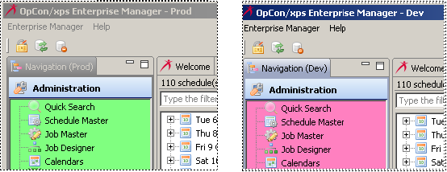

# Managing Connection Profiles

**Theme:** Configure  
**Who Is It For?** System Administrator, Automation Engineer

## What Is It?

When using the Enterprise Manager for the first time or when setting up a new database connection, define a profile with the database name, login, and password. You can also set a background color for a profile to distinguish between databases (e.g., production vs. test).

.png "More Info icon")

Related Topics

- [Setting up New Profiles](Setting-up-New-Profiles.md)
- [Editing Profiles](Editing-Profiles.md)
- [Deleting Profiles](Deleting-Profiles.md)
- [Copying Profiles](Copying-Profiles.md)

## When Would You Use It?

- You need to review or update Connection Profiles settings in Enterprise Manager
- Connection Profiles needs to be reviewed as part of routine system maintenance or a compliance audit

## Why Would You Use It?

- **Reduce administrative overhead**: Centralizing Connection Profiles management in Enterprise Manager reduces the time needed to locate and update settings across the environment
- All Connection Profiles changes are captured in the OpCon audit system, supporting change management and compliance processes

## Configuration Options

| Setting | What It Does | Default | Notes |
|---|---|---|---|

## FAQs

**Q: What does managing connection profiles involve?**

Managing connection profiles includes adding, editing, and deleting records. Access connection profiles through the Enterprise Manager navigation pane.

**Q: Who can manage connection profiles in OpCon?**

Users with the appropriate privileges assigned through their role can manage connection profiles. Contact your OpCon system administrator if you do not have access.

## Glossary

**Enterprise Manager (EM)**: OpCon's rich client graphical user interface for Windows and Linux, used to define schedules and jobs, manage automation data, and perform operational tasks.

**Resource**: A numeric variable in OpCon representing a finite pool. Jobs can be configured to require a set number of resource units to run, limiting concurrent executions and preventing resource contention.

**Role**: A named security profile in OpCon that groups privileges together. Roles are assigned to user accounts to control which features, schedules, jobs, machines, and administrative functions a user can access.

**Privilege**: A specific permission granted through an OpCon role that controls access to a feature, function, or object type. Privileges are organized into categories such as Function Privileges, Machine Privileges, Schedule Privileges, and Access Codes.

**OpCon**: Continuous' workflow automation platform. The OpCon server includes the database, SAM and Supporting Services (SAM-SS), and graphical user interfaces. agents installed on target platforms run jobs and report results.
