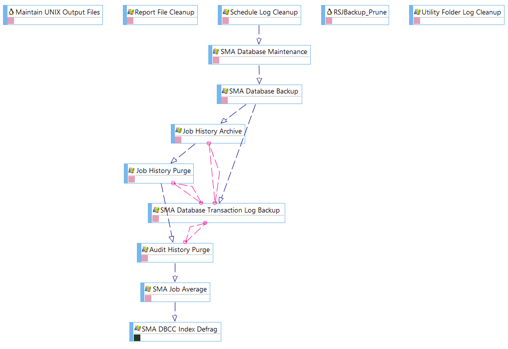
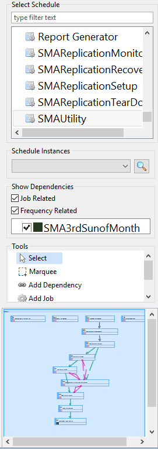

# Using Workflow Designer

**Theme:** Configure  
**Who Is It For?** System Administrator, Automation Engineer

## What Is It?

The **Workflow Designer** has three main elements: [display area](#Workflow), [action panel](#Workflow2), and [toolbar](#Workflow3).

## Workflow Designer Display Area

The **display area** provides the graphical workflow (also called a *flow diagram* or *flow map*) for a selected schedule. Each node represents a job (rectangle), threshold (rounded rectangle), or resource (oval). [Lines between nodes](Workflow-Designer-Dependency-Lines.md) represent dependency relationships. You can drag and drop dependencies for jobs, thresholds, and resources, and use [right-click functionality](Workflow-Designer-Right-Click-Menus.md) on nodes and dependency lines.

Example Flow Diagram

## Workflow Designer Action Panel

The **action panel**, to the right of the display area, lists schedules and subschedules with layout choices for viewing job dependency relationships. It provides tools to add jobs, dependencies, thresholds, and resources. The lower portion displays a small map of the entire schedule for easier navigation.

Workflow Designer Action Panel

## Workflow Designer Toolbar

The toolbar resides at the top-right corner of the screen.

.png "More Info icon")
Related Topics

- [Understanding Flow Diagram Icons](Workflow-Designer-Flow-Diagram-Icons.md)
- [Understanding Dependency Lines](Workflow-Designer-Dependency-Lines.md)
- [Using Right-click Menus](Workflow-Designer-Right-Click-Menus.md)
- [Displaying Schedule Layouts](Displaying-Schedule-Layouts.md)
- [Displaying Schedules showing Job-Related/Frequency-Related Information](Displaying-Schedules-with-Info.md)
- [Adding New Schedules](Adding-New-Schedules.md)
- [Adding Jobs to Schedule Layouts](Adding-Jobs-to-Schedule-Layouts.md)
- [Adding Thresholds to Layouts](Adding-Thresholds-to-Layouts.md)
- [Adding Resources to Layouts](Adding-Resources-to-Layouts.md)

## Configuration Options

| Setting | What It Does | Default | Notes |
|---|---|---|---|
## FAQs

**Q: What can you do with Workflow Designer?**

Workflow Designer allows you to workflow designer display area, workflow designer action panel, workflow designer toolbar.

**Q: Who has access to Workflow Designer?**

Access to Workflow Designer is controlled by the privileges assigned to your OpCon role. Contact your system administrator if you need access.

## Glossary

**Frequency**: A set of rules that defines when a job or schedule is eligible to run, based on calendar rules, day-of-week settings, period offsets, and other timing criteria.

**Threshold**: A numeric variable stored in the OpCon database used to control job execution. Jobs can be made dependent on threshold values, and OpCon events can update threshold values at runtime.

**Resource**: A numeric variable in OpCon representing a finite pool. Jobs can be configured to require a set number of resource units to run, limiting concurrent executions and preventing resource contention.

**Role**: A named security profile in OpCon that groups privileges together. Roles are assigned to user accounts to control which features, schedules, jobs, machines, and administrative functions a user can access.

**Privilege**: A specific permission granted through an OpCon role that controls access to a feature, function, or object type. Privileges are organized into categories such as Function Privileges, Machine Privileges, Schedule Privileges, and Access Codes.

**Schedule**: A named container for jobs in OpCon, built for a specific date to create that day's automation. Schedules define build settings, frequencies, and the jobs that run within them.

**Job**: The fundamental unit of work in OpCon. A job defines what to run, on which machine, when to start, and what conditions must be met. Job results are tracked and can trigger events and notifications.

**OpCon**: Continuous' workflow automation platform. The OpCon server includes the database, SAM and Supporting Services (SAM-SS), and graphical user interfaces. agents installed on target platforms run jobs and report results.
