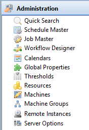

# Working with Administration

The **Administration** topic in Enterprise Manager's Navigation Panel gives you access to editors for defining and maintaining the core configuration objects that OpCon uses to run automation: schedules, jobs, machines, machine groups, resources, thresholds, global properties, calendars, and server options.

:::note
Each editor is visible only when your OpCon role grants the corresponding function privilege. For details, refer to [Departmental Function Privileges](../../../administration/privileges.md#departmental-function-privileges) in the **Concepts** online help.
:::

Select any **Administration** item in the following graphic to learn more.

## Editors in the Administration topic

The Administration topic provides the following editors. Each item opens a [Navigation Editor](Navigation-Editors.md) in the workspace.

| Editor | Purpose | Required privilege |
|---|---|---|
| **Schedule Master** | Define master schedule properties, frequencies, and build settings | Maintain Schedules |
| **Job Master** | Define jobs within master schedules, including platform details, frequencies, and dependencies | View Jobs in Master Schedules (departmental) |
| **Calendars** | Create and maintain named date collections used by schedules and frequencies | Maintain Calendars |
| **Global Properties** | Define global tokens (name/value pairs) referenced across jobs and events | Maintain Global Properties |
| **Thresholds** | Define numeric threshold variables used for job dependency and event conditions | Maintain Thresholds/Resources |
| **Resources** | Define resource pools that limit concurrent job execution | Maintain Thresholds/Resources |
| **Machines** | Define and configure agent connections for job execution | Maintain Machines |
| **Machine Groups** | Group agents for use in schedule and job assignments | Maintain Machine Groups |
| **Remote Instances** | Configure connections to remote OpCon environments | OCADM role only |
| **Server Options** | Configure OpCon server-wide settings | OCADM role only |

## Related topics

- [Navigation Editors](Navigation-Editors.md) — how to open, arrange, and manage editor tabs
- [Navigation Views](Navigation-Views.md) — read-only operational views available from the Navigation Panel
- [Navigation Panel](Navigation-Panel.md) — overview of all Navigation Panel topics
