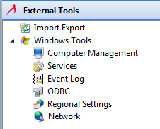

# Working with External Tools

**Theme:** Configure  
**Who Is It For?** System Administrator, Automation Engineer

## What Is It?

Once the [OpCon installation directory has been configured](Configuring-the-Installation-Directory.md) in the Enterprise Manager, you can use the **External Tools** feature. This feature gives you the opportunity to open external tools easily without having to move focus away from the Enterprise Manager. You can also [add other relevant external tools](Adding-External-Tools.md) to the list of tools.

Select on any **External Tools** function item in the graphic to learn more about that item.

.png "More Info icon") Related Topics

- [Configuring the Installation Directory](Configuring-the-Installation-Directory.md)
- [Adding External Tools](Adding-External-Tools.md)

## When Would You Use It?

- Once the [OpCon installation directory has been configured](Configuring-the-Installation-Directory.md) in the Enterprise Manager, you can use the **External Tools** feature

## Why Would You Use It?

- **Working with**: Once the [OpCon installation directory has been configured](Configuring-the-Installation-Directory.md) in the Enterprise Manager, you can use the **External Tools** feature

## Configuration Options

| Setting | What It Does | Default | Notes |
|---|---|---|---|
## FAQs

**Q: What can you do in External Tools?**

External Tools provides access to related configuration and management tasks. Use the navigation options to add, edit, or delete records as needed.

**Q: Who can access external tools in OpCon?**

Access is controlled by the privileges assigned to your OpCon role. Contact your system administrator if you need access to external tools.

## Glossary

**Enterprise Manager (EM)**: OpCon's rich client graphical user interface for Windows and Linux, used to define schedules and jobs, manage automation data, and perform operational tasks.

**Resource**: A numeric variable in OpCon representing a finite pool. Jobs can be configured to require a set number of resource units to run, limiting concurrent executions and preventing resource contention.

**Role**: A named security profile in OpCon that groups privileges together. Roles are assigned to user accounts to control which features, schedules, jobs, machines, and administrative functions a user can access.

**Privilege**: A specific permission granted through an OpCon role that controls access to a feature, function, or object type. Privileges are organized into categories such as Function Privileges, Machine Privileges, Schedule Privileges, and Access Codes.

**OpCon**: Continuous' workflow automation platform. The OpCon server includes the database, SAM and Supporting Services (SAM-SS), and graphical user interfaces. agents installed on target platforms run jobs and report results.
