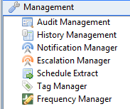

# Working with Management

**Theme:** Configure  
**Who Is It For?** System Administrator, Automation Engineer

## What Is It?

The **Management** topic in the Navigation Panel provides views to manage Audit Management, History Management, and Notification Manager information.

Select any **Management** function item in the graphic to learn more.

## Configuration Options

| Setting | What It Does | Default | Notes |
|---|---|---|---|
## FAQs

**Q: What can you do in Management?**

Management provides access to related configuration and management tasks. Use the navigation options to add, edit, or delete records as needed.

**Q: Who can access management in OpCon?**

Access is controlled by the privileges assigned to your OpCon role. Contact your system administrator if you need access to management.

## Glossary

**Notification**: A message sent by the SMA Notify Handler when a Machine, Schedule, or Job changes to a specific status. Notifications can be delivered as emails, text messages, Windows Event Log entries, SNMP traps, or other formats.

**Resource**: A numeric variable in OpCon representing a finite pool. Jobs can be configured to require a set number of resource units to run, limiting concurrent executions and preventing resource contention.

**Audit Record**: An automatically created log entry recording every change made to an OpCon object. Each record captures the timestamp, the user or application that made the change, the item affected, and the original and final values.

**Role**: A named security profile in OpCon that groups privileges together. Roles are assigned to user accounts to control which features, schedules, jobs, machines, and administrative functions a user can access.

**Privilege**: A specific permission granted through an OpCon role that controls access to a feature, function, or object type. Privileges are organized into categories such as Function Privileges, Machine Privileges, Schedule Privileges, and Access Codes.

**OpCon**: Continuous' workflow automation platform. The OpCon server includes the database, SAM and Supporting Services (SAM-SS), and graphical user interfaces. agents installed on target platforms run jobs and report results.
