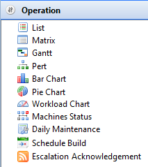

# Working with Operation

## What Is It?

The **Operation** views display all schedules to which the current user account has access in the Daily tables. Each view provides a different way of looking at schedules and jobs.

Select any **Operation** function item in the graphic to learn more about that item.

## Operation Toolbar Settings

The **Gantt**, **PERT**, **Bar Chart**, **Pie Chart**, and **Workload Chart** views, as well as the **Daily list** and **Matrix** views, rely on two toolbar settings located at the top-right of the screen to share selection information between views.

| Setting | What It Does |
|---|---|
| **Listen for selection changes in other views** | Required by the **Gantt**, **PERT**, **Bar Chart**, **Pie Chart**, and **Workload Chart** views to display individual dates and schedule information. In the **Daily list** and **Matrix** views, this setting also lets you display the same information in a different view (for example, viewing the same schedule from the **Daily list** view in the **Matrix** view). |
| **Send the current selection to other views** | Required by the **Daily list** and **Matrix** views to send dates and schedule information to the appropriate views. |

To view changes simultaneously in both the **Matrix** and **Daily list** views, refer to the [Synchronizing Data between Matrix and List Views](Synchronizing-Data-between-Matrix-and-List-Views.md) procedure.

## Operation Right-click Menus

In the **Operation** views, right-click a schedule or job to open the **Operation** right-click menus.

### Schedule Right-click Menu

Right-click a schedule in the **Daily list** and **Matrix** views to show the following menu items:

- **Schedule Information**: Refer to [Schedule Information](Schedule-Information.md)
- **Schedule History**: Refer to [Schedule History](Schedule-History.md)
- **Maintenance**: Hovering over this menu item shows the following submenu items:
  - **Edit Daily Schedule**:
    - Daily list: Refer to [Editing Daily Schedules](Performing-Schedule-Procedures-List.md#Editing)
    - Matrix: Refer to [Editing Daily Schedules](Performing-Schedule-Procedures-Matrix.md#Editing)
  - **Edit Master Schedule**:
    - Daily list: Refer to [Editing Master Schedules](Performing-Schedule-Procedures-List.md#Editing2)
    - Matrix: Refer to [Editing Master Schedules](Performing-Schedule-Procedures-Matrix.md#Editing2)
  - **Check Schedule**:
    - Daily list: Refer to [Checking Schedules](Performing-Schedule-Procedures-List.md#Checking)
    - Matrix: Refer to [Checking Schedules](Performing-Schedule-Procedures-Matrix.md#Checking)
  - **Delete Schedule**:
    - Daily list: Refer to [Deleting Schedules](Performing-Schedule-Procedures-List.md#Deleting)
    - Matrix: Refer to [Deleting Schedules](Performing-Schedule-Procedures-Matrix.md#Deleting)
  - **Add Jobs**:
    - Daily list: Refer to [Adding Jobs](Performing-Schedule-Procedures-List.md#Adding)
    - Matrix: Refer to [Adding Jobs](Performing-Schedule-Procedures-Matrix.md#Adding)
- **Schedule Status choices**: Dialogs display the schedule date and schedule name. Refer to [Schedule Status Change Commands](../../../operations/status-change-commands.md#schedule) in the **Concepts** online help
- **Update Jobs Statuses**: The **Update Job statuses** dialog displays the schedule date and name and lets you update all jobs or jobs by status within the selected schedule. Refer to [Jobs Status Change Commands](../../../operations/status-change-commands.md#jobs) in the **Concepts** online help

### Job Right-click Menu

Right-click a job in the **Daily list**, **Matrix**, **PERT**, or **Gantt** views to show the following menu items:

- **SubSchedule Information**: For a Container job, displays the **SubSchedule Information** screen. Refer to [SubSchedule Information](SubSchedule-Information.md)
- **Job Information**: Refer to [Job Information](Job-Information.md)
- **Job History**: Refer to [Job History](Job-History.md)
- **Comment**: Provides a dialog to enter a quick comment about a completed job to the history record for the most recent job instance.
  - Daily list: Refer to [Adding Job Completion Comments](Performing-Job-Procedures-List.md#Adding)
  - Matrix: Refer to [Adding Job Completion Comments](Performing-Job-Procedures-Matrix.md#Adding)
  - Gantt or PERT: Refer to [Adding Job Completion Comments](Performing-Job-Procedures-Gantt.md#Adding)
- **View Job Output**:
  - Daily list: Refer to [Viewing Job Output](Performing-Job-Procedures-List.md#Viewing)
  - Matrix: Refer to [Viewing Job Output](Performing-Job-Procedures-Matrix.md#Viewing)
  - Gantt or PERT: Refer to [Viewing Job Output](Performing-Job-Procedures-Gantt.md#Viewing)
- **Window To Host**: Opens a dialog to open the emulator for the selected job's machine. For emulator configuration, refer to [Setting Preferences for Window To Host](Preferences-for-Windows-To-Host.md)
  - Daily list: Refer to [Opening Window to Host](Performing-Job-Procedures-List.md#Opening)
  - Matrix: Refer to [Opening Window to Host](Performing-Job-Procedures-Matrix.md#Opening)
  - Gantt or PERT: Refer to [Opening Window to Host](Performing-Job-Procedures-Gantt.md#Opening)
- **Maintenance**: Hovering over this menu item shows the following submenu items:
  - **Edit Daily Job**:
    - Daily list: Refer to [Editing Daily Jobs](Performing-Job-Procedures-List.md#Editing2)
    - Matrix: Refer to [Editing Daily Jobs](Performing-Job-Procedures-Matrix.md#Editing2)
    - Gantt or PERT: Refer to [Editing Daily Jobs](Performing-Job-Procedures-Gantt.md#Editing2)
  - **Edit Master Job**:
    - Daily list: Refer to [Editing Master Jobs](Performing-Job-Procedures-List.md#Editing)
    - Matrix: Refer to [Editing Master Jobs](Performing-Job-Procedures-Matrix.md#Editing)
    - Gantt or PERT: Refer to [Editing Master Jobs](Performing-Job-Procedures-Gantt.md#Editing)
  - **Delete Job**:
    - Daily list: Refer to [Deleting Jobs](Performing-Job-Procedures-List.md#Deleting)
    - Matrix: Refer to [Deleting Jobs](Performing-Job-Procedures-Matrix.md#Deleting)
    - Gantt or PERT: Refer to [Deleting Jobs](Performing-Job-Procedures-Gantt.md#Deleting)
- **Job Status choices**: Dialogs display the schedule date, schedule name, and job name. Refer to [Jobs Status Change Commands](../../../operations/status-change-commands.md#Jobs) in the **Concepts** online help
- **SAP Child Processes**: For SAP R/3 and CRM jobs, opens a dialog to monitor and/or restart child processes. The dialog can remain open while you work in the primary Enterprise Manager screen. Refer to [SAP Child Processes](../../../operations/SAP-Job-Menu-Options.md#SAP) in the **Concepts** online help
  - Daily list: Refer to [Monitoring SAP Child Processes](Performing-Job-Procedures-List.md#Monitori) and [Restarting SAP Child Processes](Performing-Job-Procedures-List.md#Restarti)
  - Matrix: Refer to [Monitoring SAP Child Processes](Performing-Job-Procedures-Matrix.md#Monitori) and [Restarting SAP Child Processes](Performing-Job-Procedures-Matrix.md#Restarti)
  - Gantt or PERT: Refer to [Monitoring SAP Child Processes](Performing-Job-Procedures-Gantt.md#Monitori) and [Restarting SAP Child Processes](Performing-Job-Procedures-Gantt.md#Restarti)
- **SAP Job Spools**: For SAP R/3 and CRM jobs, opens a dialog to retrieve individual spool files generated by a job. Refer to [SAP Job Spools](../../../operations/SAP-Job-Menu-Options.md#SAP2) in the **Concepts** online help
  - Daily list: Refer to [Viewing SAP Job Spools](Performing-Job-Procedures-List.md#Viewing2)
  - Matrix: Refer to [Viewing SAP Job Spools](Performing-Job-Procedures-Matrix.md#Viewing2)
  - Gantt or PERT: Refer to [Viewing SAP Job Spools](Performing-Job-Procedures-Gantt.md#Viewing2)

## Related Topics

- [Schedule Information](Schedule-Information.md)
- [Schedule History](Schedule-History.md)
- [Job Information](Job-Information.md)
- [Job History](Job-History.md)
- [SubSchedule Information](SubSchedule-Information.md)
- [Setting Preferences for Window To Host](Preferences-for-Windows-To-Host.md)
- [Synchronizing Data between Matrix and List Views](Synchronizing-Data-between-Matrix-and-List-Views.md)

## Glossary

**Container Job**: A job type that runs a subschedule. Container jobs enable hierarchical schedule structures and support properties and events just like standard jobs.

**Daily Tables**: The OpCon database tables that hold the active, date-specific instances of schedules and jobs built to run. Changes to daily tables affect only the current day's automation.

**Machine**: A platform defined in the OpCon database that has an Agent installed. OpCon routes job run requests to machines via SMANetCom, and machines report job completion status back to SAM.

**Schedule**: A named container for jobs in OpCon, built for a specific date to create that day's automation. Schedules define build settings, frequencies, and the jobs that run within them.

**Job**: The fundamental unit of work in OpCon. A job defines what to run, on which machine, when to start, and what conditions must be met. Job results are tracked and can trigger events and notifications.
