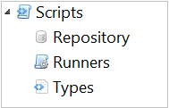

# Working with Scripts

**Theme:** Configure  
**Who Is It For?** System Administrator, Automation Engineer

## What Is It?

The **Scripts** topic in the Navigation Panel provides views to manage the script repository, script runners, and script types.

Select on any **Administration** function item in the graphic to learn more about that item.

## Configuration Options

| Setting | What It Does | Default | Notes |
|---|---|---|---|
## FAQs

**Q: What can you do in Scripts?**

Scripts provides access to related configuration and management tasks. Use the navigation options to add, edit, or delete records as needed.

**Q: Who can access scripts in OpCon?**

Access is controlled by the privileges assigned to your OpCon role. Contact your system administrator if you need access to scripts.

## Glossary

**Resource**: A numeric variable in OpCon representing a finite pool. Jobs can be configured to require a set number of resource units to run, limiting concurrent executions and preventing resource contention.

**Role**: A named security profile in OpCon that groups privileges together. Roles are assigned to user accounts to control which features, schedules, jobs, machines, and administrative functions a user can access.

**Privilege**: A specific permission granted through an OpCon role that controls access to a feature, function, or object type. Privileges are organized into categories such as Function Privileges, Machine Privileges, Schedule Privileges, and Access Codes.

**OpCon**: Continuous' workflow automation platform. The OpCon server includes the database, SAM and Supporting Services (SAM-SS), and graphical user interfaces. agents installed on target platforms run jobs and report results.
