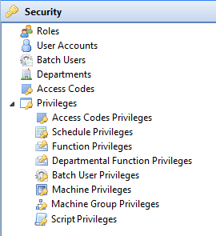

# Working with Security

The **Security** topic in the Enterprise Manager Navigation Panel provides editors to manage user accounts, roles, batch users, departments, access codes, and privileges. Use these editors to control who can log in to OpCon and what each user can see and do.

## Security editors

The following editors are available under the **Security** topic:

| Editor | Purpose |
| --- | --- |
| [Roles](Managing-Roles.md) | Create and manage security profiles that group privileges together. Assign roles to user accounts to control access. |
| [User Accounts](Managing-User-Accounts.md) | Define and maintain OpCon user accounts, including passwords, login options, and role assignments. |
| [Batch Users](Managing-Batch-Users.md) | Define operating system user credentials that OpCon uses to run jobs on target machines. |
| [Departments](Managing-Departments.md) | Create logical groupings for jobs that enable departmental function privilege assignments. |
| [Access Codes](Managing-Access-Codes.md) | Create codes to restrict which roles can view or update specific jobs in master and daily schedules. |
| [Privileges](Managing-Privileges.md) | Grant or revoke specific permissions for roles across functions, machines, schedules, scripts, and access codes. |

### Privilege types

Selecting the expand arrow next to **Privileges** in the Navigation Panel exposes the following privilege editors:

- [Access Codes Privileges](Managing-Access-Codes-Privileges.md)
- [Schedule Privileges](Managing-Schedule-Privileges.md)
- [Function Privileges](Managing-Function-Privileges.md)
- [Departmental Function Privileges](Managing-Dept-Function-Privileges.md)
- [Batch User Privileges](Managing-Batch-User-Privileges.md)
- [Machine Privileges](Managing-Machine-Privileges.md)
- [Machine Group Privileges](Managing-Machine-Group-Privileges.md)
- [Script Privileges](Managing-Script-Privileges.md)

## Access requirements

Access to the Security editors is controlled by the privileges assigned to your OpCon role. Users with the **All Administration Functions** privilege can access all Security editors. Individual editors may also be accessible through more specific privileges such as **Maintain Access Codes** or **Maintain Departments**. Contact your system administrator if you need access to a Security editor.

For toolbar buttons available within each editor, see [Using Security Tools](Using-Security-Tools.md).
