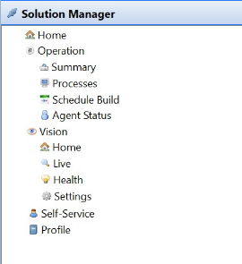

# Managing Solution Manager

**Theme:** Configure  
**Who Is It For?** System Administrator, Automation Engineer

## What Is It?

The **Solution Manager** topic in the Navigation Panel provides links to access Solution Manager modules and pages from within the Enterprise Manager.

:::note
The Solution Manager topic will only appear in the Navigation Panel if the **Solution Manager URL** General Server Option is defined. For more information, refer to [Solution Manager URL](../../../administration/server-options.md#general) in the **Concepts** online help.
:::

:::note
To view licensed modules or features, you must have the appropriate privileges. For additional information, refer to [Managing Self Service](../Solution-Manager/Managing-Self-Service.md) and [Working with Vision](../Solution-Manager/Working-with-Vision.md) in the **Solution Manager** online help.
:::

Select on any **Solution Manager** function item in the graphic to learn more about that item.

## When Would You Use It?

- You need to review or update Solution Manager settings in Solution Manager
- Solution Manager needs to be reviewed as part of routine system maintenance or a compliance audit

## Why Would You Use It?

- **Reduce administrative overhead**: Centralizing Solution Manager management in Solution Manager reduces the time needed to locate and update settings across the environment
- All Solution Manager changes are captured in the OpCon audit system, supporting change management and compliance processes

## FAQs

**Q: What does managing solution manager involve?**

Managing solution manager includes adding, editing, and deleting records. Access solution manager through the Enterprise Manager navigation pane.

**Q: Who can manage solution manager in OpCon?**

Users with the appropriate privileges assigned through their role can manage solution manager. Contact your OpCon system administrator if you do not have access.

## Glossary

**Enterprise Manager (EM)**: OpCon's rich client graphical user interface for Windows and Linux, used to define schedules and jobs, manage automation data, and perform operational tasks.

**Solution Manager**: OpCon's browser-based graphical user interface for managing automation data, performing operational actions, and administering the system.

**Resource**: A numeric variable in OpCon representing a finite pool. Jobs can be configured to require a set number of resource units to run, limiting concurrent executions and preventing resource contention.

**Role**: A named security profile in OpCon that groups privileges together. Roles are assigned to user accounts to control which features, schedules, jobs, machines, and administrative functions a user can access.

**Privilege**: A specific permission granted through an OpCon role that controls access to a feature, function, or object type. Privileges are organized into categories such as Function Privileges, Machine Privileges, Schedule Privileges, and Access Codes.

**OpCon**: Continuous' workflow automation platform. The OpCon server includes the database, SAM and Supporting Services (SAM-SS), and graphical user interfaces. agents installed on target platforms run jobs and report results.
