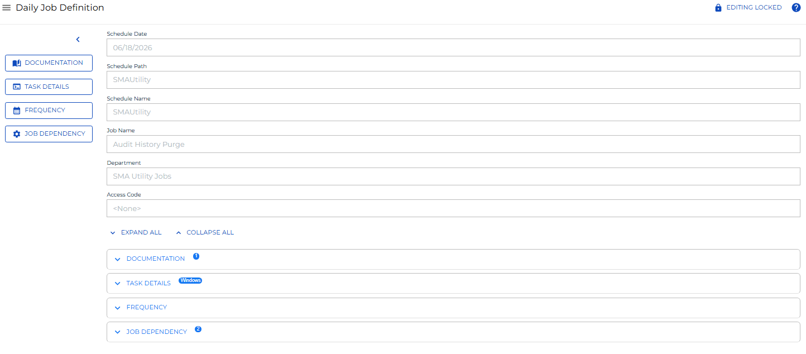
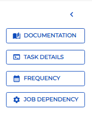

# Accessing Daily Job Definition

**Theme:** Configure  
**Who Is It For?** System Administrator, Automation Engineer

## What Is It?

As part of the **Operations** module, users with the appropriate privileges can view the daily job definition and modify job properties. **Daily Job Definition** has two modes:

- **Read-only**: Review defined properties for the selected job. Properties cannot be edited in this mode
- **Admin**: Modify properties, including reconfiguring platform-specific details, for the selected job

## When Would You Use It?

- You need to retrieve or review Daily Job Definition information from Solution Manager

## Why Would You Use It?

- **Accessing Daily**: As part of the **Operations** module, users with the appropriate privileges can view the daily job definition and modify job properties

## Administration

### Required Privileges

To view the daily job definition, you must have at least all of the following privileges:

- **Schedule Privilege**: User must be in a role with access to the job's parent schedule
- **Departmental Function Privilege**: User must be in a role with View Jobs in Daily Schedules and View Jobs in Schedule Operations privileges for the assigned job's department
- **Access Code Privilege**: User must be in a role with access to the assigned job access code

To edit the daily job definition, you must be in the ocadm role or have at least all of the following privileges:

- **Schedule Privilege**: User must be in a role with access to the job's parent schedule
- **Departmental Function Privilege**: User must be in a role with View Jobs in Daily Schedules, View Jobs in Schedule Operations, and Modify Jobs in Daily Schedules privileges for the assigned job's department
- **Access Code Privilege**: User must be in a role with access to the assigned job access code with the **Allow job updates** flag set to true

## Daily Job Definition Access

To access the daily job definition, complete the following steps:

1. Select the **Processes** button at the top-right of the **Operations Summary** page. The **Processes** page displays
2. Ensure both the **Date** and **Schedule** toggle switches are enabled. Each switch appears green when enabled
3. Select the desired **date(s)** to display the associated schedule(s)
4. Select one or more **schedule(s)** in the list
5. Select one **job** in the list. Your selection appears in the [status bar](SM-UI-Layout.md#Status) at the bottom of the page as a breadcrumb trail
6. Select the job record (e.g., 1 job(s)) in the status bar to display the **Selection** panel
7. Select the **Daily Job Definition** button  at the top-left corner of the panel. By default, the page opens in **Read-only** mode
8. Select the **Cancel** button to return to the previous page
9. Close the **Selection** panel when done

:::note
Daily Job Definition can also be accessed while in PERT View. For more information, refer to [PERT View Daily Job Definition Access](Using-PERT-View.md#PERT10).
:::

## Daily Job Definition Properties

**Daily Job Definition** contains general job information and expandable panels that expose defined properties. Users with appropriate privileges see a **Lock** button at the top-right corner to switch between modes. The button appears gray and locked () in **Read-only** mode and green and unlocked () in **Admin** mode. A [menu](#Daily3) provides quick access to all panels.

Daily Job Definition in Solution Manager

### General Info

For information about the **General Info** section, refer to [Viewing and Updating General Info](Viewing-and-Updating-General-Info.md).

### Daily Job Definition Panels

Each expandable panel on the **Daily Job Definition** page represents a job property category.

- In **Read-only** mode, only panels with defined properties are displayed and cannot be changed
- In **Admin** mode, all available panels are displayed and properties may be modified

Select any of the following links to learn more about each panel:

- [Documentation](Viewing-and-Updating-Documentation.md)
- [Task Details](Viewing-and-Updating-Job-Task-Details.md)
- [Frequency](Viewing-and-Updating-Job-Frequencies.md)
- [Instance Properties](Viewing-and-Updating-Instance-Properties.md)
- [Expression Dependency](Viewing-and-Updating-Expression-Dependencies.md)
- [Resource Dependency](Viewing-and-Updating-Resource-Dependencies.md)
- [Threshold Dependency](Viewing-and-Updating-Threshold-Dependencies.md)
- [Resource Update](Viewing-and-Updating-Resource-Updates.md)
- [Threshold Update](Viewing-and-Updating-Threshold-Updates.md)

### Daily Job Definition Menu

The menu in the left portion of the page provides quick access to any panel. The menu can be collapsed to show icons and tooltips only. Selecting a menu item scrolls to that panel and expands it. right-clicking a menu item toggles **Full Screen** mode.

.png "More Info icon") Related Topics

- [Accessing Job Summary](Accessing-Job-Summary.md)
- [Using PERT View](Using-PERT-View.md)
- [Viewing and Updating General Info](Viewing-and-Updating-General-Info.md)
- [Viewing and Updating Documentation](Viewing-and-Updating-Documentation.md)
- [Viewing and Updating Instance Properties](Viewing-and-Updating-Instance-Properties.md)
- [Viewing and Updating Job Task Details](Viewing-and-Updating-Job-Task-Details.md)
- [Viewing and Updating Job Frequencies](Viewing-and-Updating-Job-Frequencies.md)
- [Viewing and Updating Expression Dependencies](Viewing-and-Updating-Expression-Dependencies.md)
- [Viewing and Updating Resource Dependencies](Viewing-and-Updating-Resource-Dependencies.md)
- [Viewing and Updating Threshold Dependencies](Viewing-and-Updating-Threshold-Dependencies.md)
- [Viewing and Updating Resource Updates](Viewing-and-Updating-Resource-Updates.md)
- [Viewing and Updating Threshold Updates](Viewing-and-Updating-Threshold-Updates.md)

## Configuration Options

| Setting | What It Does | Default | Notes |
|---|---|---|---|
| Read-only | Review defined properties for the selected job. | — | must be in a role with access to the job's parent schedule. - **Departmental Function Pr |
| Admin | Modify properties, including reconfiguring platform-specific details, for the selected job | — | must be in a role with access to the job's parent schedule. - **Departmental Function Pr |
| Schedule Privilege | User must be in a role with access to the job's parent schedule | — | must be in a role with access to the job's parent schedule. - **Departmental Function Pr |
| Departmental Function Privilege | User must be in a role with View Jobs in Daily Schedules and View Jobs in Schedule Operations privileges for the assigned job's department | — | must be in a role with View Jobs in Daily Schedules and View Jobs in Schedule Operations |
| Access Code Privilege | User must be in a role with access to the assigned job access code | — | must be in a role with access to the assigned job access code.  To edit the daily job de |
## FAQs

**Q: How many steps does the Accessing Daily Job Definition procedure involve?**

The Accessing Daily Job Definition procedure involves 9 steps. Complete all steps in order and save your changes.

**Q: What does Accessing Daily Job Definition cover?**

This page covers Required Privileges, Daily Job Definition Access, Daily Job Definition Properties.

## Glossary

**Solution Manager**: OpCon's browser-based graphical user interface for managing automation data, performing operational actions, and administering the system.

**Frequency**: A set of rules that defines when a job or schedule is eligible to run, based on calendar rules, day-of-week settings, period offsets, and other timing criteria.

**Threshold**: A numeric variable stored in the OpCon database used to control job execution. Jobs can be made dependent on threshold values, and OpCon events can update threshold values at runtime.

**Access Code**: A security label applied to jobs and schedules in OpCon. Users must have the matching access code privilege to view or manage items with that label.

**Department**: An organizational grouping in OpCon used to assign jobs to logical divisions. User roles can be scoped to specific departments, controlling which jobs a user can manage.

**Resource**: A numeric variable in OpCon representing a finite pool. Jobs can be configured to require a set number of resource units to run, limiting concurrent executions and preventing resource contention.

**Role**: A named security profile in OpCon that groups privileges together. Roles are assigned to user accounts to control which features, schedules, jobs, machines, and administrative functions a user can access.

**Privilege**: A specific permission granted through an OpCon role that controls access to a feature, function, or object type. Privileges are organized into categories such as Function Privileges, Machine Privileges, Schedule Privileges, and Access Codes.
