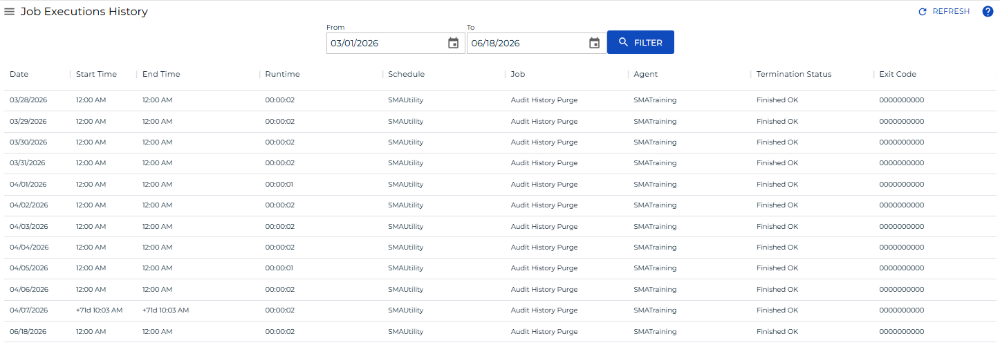

# Accessing Job Executions History

**Theme:** Configure  
**Who Is It For?** System Administrator, Automation Engineer

## What Is It?

In the **Operations** module, you can access all iterations (executions history) of a job and view job output from past executions. A runtime trend for a range of executions is also available at the bottom of the page.

When viewing job executions history, the following information is displayed per execution:

- **Date**: The date of the Daily schedule for which the job run
- **Start Time**: The actual date and time the schedule started (24-hour format, 00:00)
- **End Time**: The date and time the job ended (24-hour format, 00:00)
- **Runtime**: The amount of time the job ran, in minutes
- **Schedule**: The name of the schedule containing the selected job
- **Job**: The name of the selected job
- **Agent**: The name of the agent machine on which the job run. For jobs that run on each machine in a group, the machine name displays for each copy of the job that ran
- **Termination Status**: The completion status of the job
- **Exit Code**: The numeric value returned when the job terminated

Results display in a sortable table. Select a column heading to sort ascending; select it again to sort descending.

To access job execution history, complete the following steps:

1. Select the **Processes** button at the top-right of the **Operations Summary** page
2. Ensure that both the **Date** and **Schedule** toggle switches are enabled (green) so you can make your date and schedule selection
3. Select the desired **date(s)** to display the associated schedule(s)
4. Select one or more **schedule(s)** in the list
5. Select one **job** in the list. Your selection displays in the [status bar](SM-UI-Layout.md#Status) at the bottom of the page as a breadcrumb trail
6. Select the job record (e.g., 1 job(s)) in the status bar to display the **Selection** panel
7. Select the **Job Executions History** button  at the top-left corner of the panel. By default, the history for the selected date displays
8. Enter a *Start Date* and *End Date* in the date fields at the top of the page, or select the **calendar icon** to pick a date
9. Select the **Filter** button to display results. If multiple executions exist, the runtime trend for the period displays
10. Select a job executions history record and right-click it to access available job output in the **Selection** panel to the right
    :::note
    The job output record for the historical instance must still exist on the target platform for this operation to succeed.
    :::
11. Select the **Refresh** button to fetch existing or new job output files for the selected job. The button toggles to **Cancel**, which you can select at any time to stop the refresh
12. Select the **Close** button to close the panel

:::note
Job execution history can also be accessed in PERT View. For more information, refer to [PERT View Job Executions History Access](Using-PERT-View.md#PERT11).
:::

.png "More Info icon") Related Topics

- [Accessing Job Summary](Accessing-Job-Summary.md)
- [Using PERT View](Using-PERT-View.md)

## When Would You Use It?

- You need to retrieve or review Job Executions History information from Solution Manager

## Why Would You Use It?

- **Accessing Job**: In the **Operations** module, you can access all iterations (executions history) of a job and view job output from past executions

## Configuration Options

| Setting | What It Does | Default | Notes |
|---|---|---|---|
| Date | The date of the Daily schedule for which the job run | — | — |
| Start Time | The actual date and time the schedule started (24-hour format, 00:00) | — | — |
| End Time | The date and time the job ended (24-hour format, 00:00) | — | — |
| Runtime | The amount of time the job ran, in minutes | — | — |
| Agent | The name of the agent machine on which the job run. | — | — |
| Termination Status | The completion status of the job | — | — |
| Exit Code | The numeric value returned when the job terminated | — | — |
## FAQs

**Q: How many steps does the Accessing Job Executions History procedure involve?**

The Accessing Job Executions History procedure involves 12 steps. Complete all steps in order and save your changes.

## Glossary

**LSAM (Local Schedule Activity Monitor)**: An agent installed on a target platform that runs jobs in the native language of that platform and communicates results back to SAM via SMANetCom over TCP/IP.

**Solution Manager**: OpCon's browser-based graphical user interface for managing automation data, performing operational actions, and administering the system.

**Calendar**: A named collection of dates in OpCon used by schedules and frequencies to determine when automation runs or is excluded. Calendars can represent holidays, working days, or any custom date set.

**Resource**: A numeric variable in OpCon representing a finite pool. Jobs can be configured to require a set number of resource units to run, limiting concurrent executions and preventing resource contention.

**Machine**: A platform defined in the OpCon database that has an agent installed. OpCon routes job execution requests to machines via SMANetCom, and machines report job completion status back to SAM.

**Schedule**: A named container for jobs in OpCon, built for a specific date to create that day's automation. Schedules define build settings, frequencies, and the jobs that run within them.

**Job**: The fundamental unit of work in OpCon. A job defines what to run, on which machine, when to start, and what conditions must be met. Job results are tracked and can trigger events and notifications.
