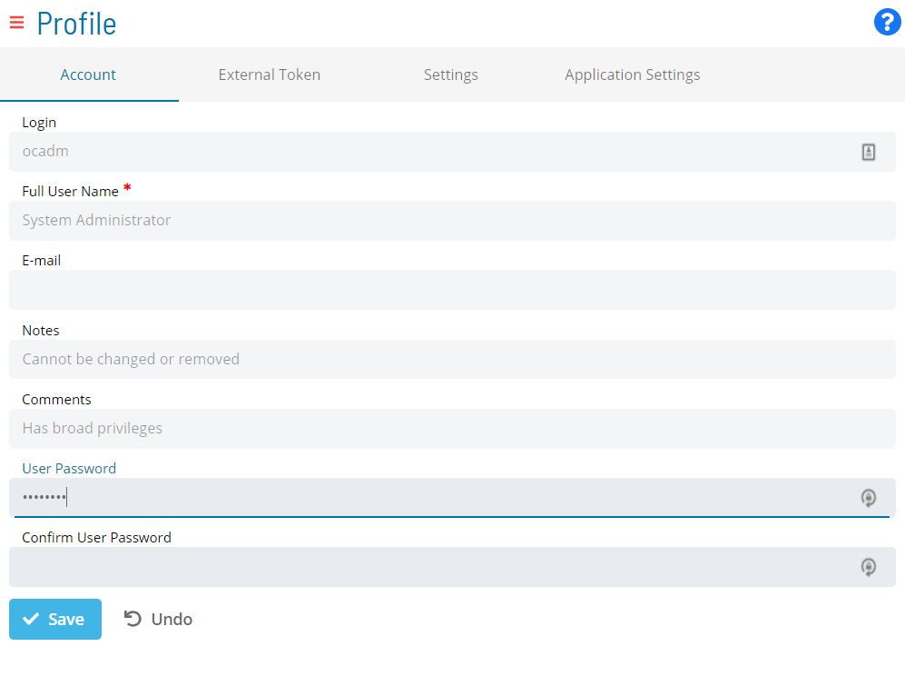

# Accessing and Updating Profile Settings

**Theme:** Configure  
**Who Is It For?** System Administrator, Automation Engineer

## What Is It?

 
 

Access the **Profile** page from the [Navigation menu](SM-UI-Layout.md#Navigati) to configure settings from one of these tabs:

- [Account](Configuring-Account-Settings.md)
- [External Token](Generating-External-Tokens.md)
- [Settings](Configuring-Settings.md)
- [Application Settings](Configuring-Application-Settings.md)

## When Would You Use It?

- You need to retrieve or review and Updating Profile Settings information from Solution Manager

## Why Would You Use It?

- **Streamlined workflow**: Access the **Profile** page from the [Navigation menu](SM-UI-Layout.md#Navigati) to configure settings from one of these tabs:

## Configuration Options

| Setting | What It Does | Default | Notes |
|---|---|---|---|
## FAQs

**Q: What does Accessing and Updating Profile Settings do?**

**Q: Where can you find Accessing and Updating Profile Settings in OpCon?**

Access Accessing and Updating Profile Settings through the appropriate section in the Enterprise Manager or Solution Manager navigation.

## Glossary

**Enterprise Manager (EM)**: OpCon's rich client graphical user interface for Windows and Linux, used to define schedules and jobs, manage automation data, and perform operational tasks.

**Solution Manager**: OpCon's browser-based graphical user interface for managing automation data, performing operational actions, and administering the system.

**Token (Global Property)**: A named value stored in the OpCon database, referenced in job definitions and events using [[PropertyName]] syntax. Tokens pass dynamic values — such as dates, file paths, or counts — into automation workflows.

**Resource**: A numeric variable in OpCon representing a finite pool. Jobs can be configured to require a set number of resource units to run, limiting concurrent executions and preventing resource contention.

**OpCon**: Continuous' workflow automation platform. The OpCon server includes the database, SAM and Supporting Services (SAM-SS), and graphical user interfaces. agents installed on target platforms run jobs and report results.
