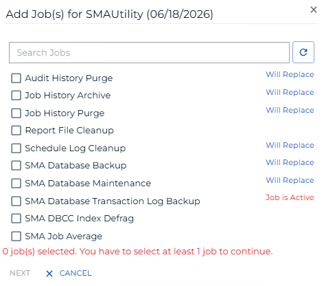
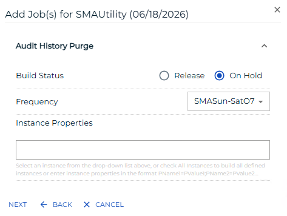
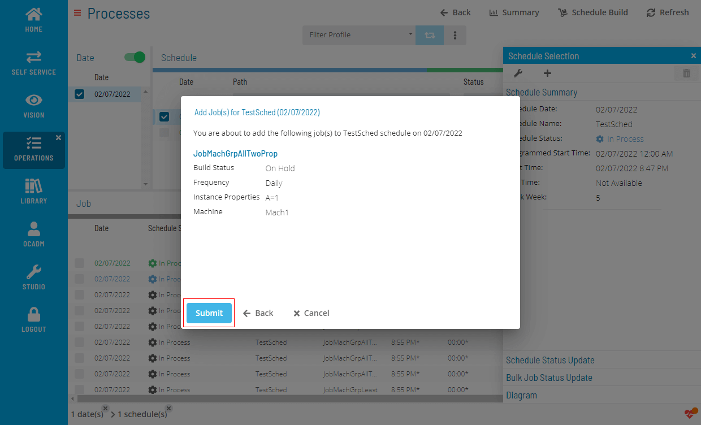
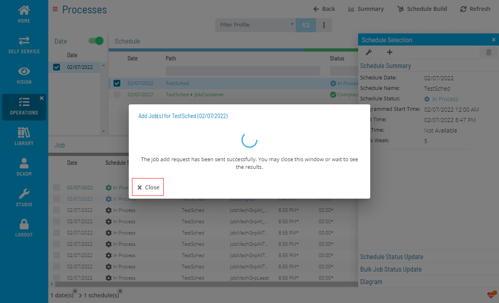
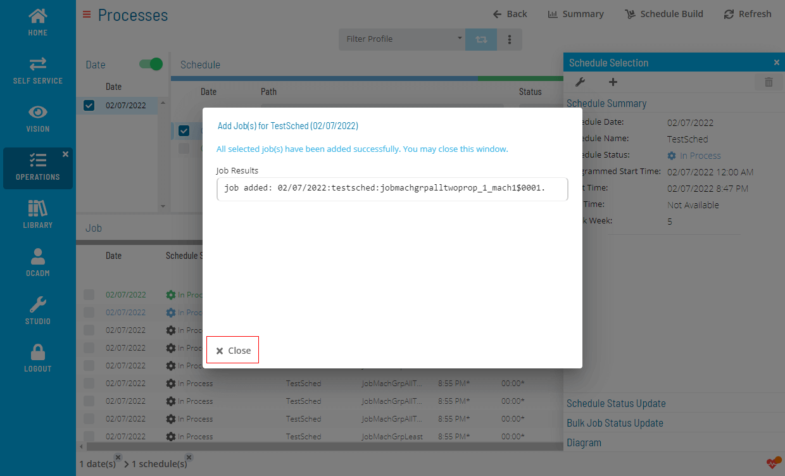

# Adding Jobs to Daily Schedules

**Theme:** Configure  
**Who Is It For?** System Administrator, Automation Engineer

## What Is It?

The **Operations** module allows you to add jobs to daily schedules.

To add a job to a Daily Schedule, complete the following steps:

1. Right-click on a Schedule record and select the **+** icon to open the Add Job(s) dialog
    dialog")

2. Find and select job(s) by searching or browsing
   

3. Configure the selected job(s)
   

4. Review the configured job(s) before submitting
   

5. Wait for the results
   

6. Review the results
   

.png "More Info icon")
Related Topics

- [Performing Schedule Checks](Performing-Schedule-Checks.md)
- [Deleting Schedules and Jobs](Deleting-Schedules-and-Jobs.md)

## When Would You Use It?

- You need to add Jobs to Daily Schedules in Solution Manager
- The environment is expanding and requires additional Jobs to Daily Schedules to support new automation workflows

## Why Would You Use It?

- **Extend automation scope**: Adding Jobs to Daily Schedules to OpCon brings additional resources under centralized scheduling, monitoring, and event processing
- All additions are tracked in the OpCon audit log, recording who added the Jobs to Daily Schedules and when

## FAQs

**Q: How do you save a new jobs to daily schedules record?**

After completing the required fields, select the **Save** button on the toolbar to save the jobs to daily schedules record.

## Glossary

**Resource**: A numeric variable in OpCon representing a finite pool. Jobs can be configured to require a set number of resource units to run, limiting concurrent executions and preventing resource contention.

**Schedule**: A named container for jobs in OpCon, built for a specific date to create that day's automation. Schedules define build settings, frequencies, and the jobs that run within them.

**Job**: The fundamental unit of work in OpCon. A job defines what to run, on which machine, when to start, and what conditions must be met. Job results are tracked and can trigger events and notifications.
