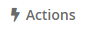
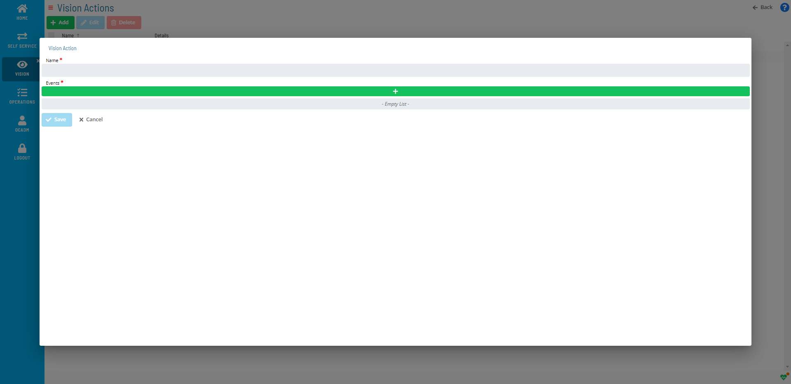
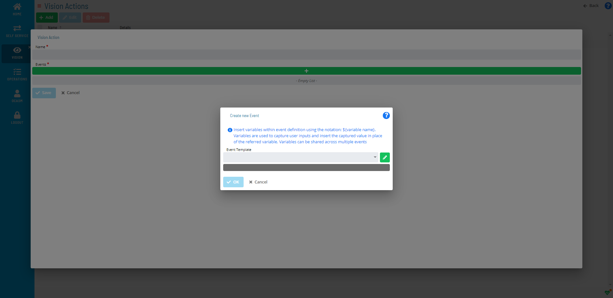

# Adding Vision Actions

**Theme:** Configure  
**Who Is It For?** System Administrator, Automation Engineer

## What Is It?

Use this procedure to add Vision Actions in Solution Manager.

To add a Vision Action, complete the following steps:

1. Select the **Actions** button on the **Vision Live** page or the **Vision Settings** page

   

2. Select the **Add** button on the **Vision Actions** page

   

3. In the **Vision Action** window, enter a *Name* for the action

   

4. Select the **+** button to add **Events**. The **Create new Event** window displays

   

5. Select an **OpCon Event Template**. The screen updates dynamically to provide UI assistance for filling out the event details

   :::note
   The **Event Template** list contains several Administrative Events for advanced operations. For more information, refer to [Administrative Events](../../../events/types.md) in the **OpCon Events** online help.
   :::

6. Fill out the *fields* to define the event

   :::note
   Do not include user variables `${variable}` in Vision actions — there is no place to enter user input when the action triggers. You may use the following system variables for Vision cards:

   - **\[\[CI.$CARD NAME\]\]** — Resolves to the card name
   - **\[\[CI.$CARD FREQUENCY NAME\]\]** — Resolves to the frequency name defined for the card
   - **\[\[CI.$CARD STATUS\]\]** — Resolves to the status that triggered the Vision action
   - **\[\[CI.$CARD START TIME\]\]** — Resolves to the estimated or actual start time for the card
   - **\[\[CI.$CARD END TIME\]\]** — Resolves to the estimated or actual end time for the card
   - **\[\[CI.$REMOTE INSTANCE NAME\]\]** — Resolves to the remote instance name defined for the card
   - **\[\[CI.$SCHEDULE DATE\]\]** — Resolves to the schedule date defined for the card

   You can use the same variable multiple times within the same event or across events for the same action. Variables are resolved before the event is sent to OpCon.
   :::

7. Select the **Save** button

*(Optional)* Repeat steps 2–7 to add additional events.

## When Would You Use It?

- You need to add Vision Actions in Solution Manager
- The environment is expanding and requires additional Vision Actions to support new automation workflows

## Why Would You Use It?

- **Extend automation scope**: Adding Vision Actions to OpCon brings additional resources under centralized scheduling, monitoring, and event processing
- All additions are tracked in the OpCon audit log, recording who added the Vision Actions and when

## Configuration Options

| Setting | What It Does | Default | Notes |
|---|---|---|---|

## FAQs

**Q: How do you save a new vision actions record?**

After completing the required fields, select the **Save** button on the toolbar to save the vision actions record.

**Q: Is documentation required when adding vision actions?**

No. The Documentation field is optional. You can enter notes about the vision actions to track its purpose, but it is not required to save the record.

## Glossary

**Frequency**: A set of rules that defines when a job or schedule is eligible to run, based on calendar rules, day-of-week settings, period offsets, and other timing criteria.

**OpCon Event**: A command sent to OpCon that triggers an automated action, such as adding a job to a schedule, updating a property value, sending a notification, or changing a job or schedule status.

**Resource**: A numeric variable in OpCon representing a finite pool. Jobs can be configured to require a set number of resource units to run, limiting concurrent executions and preventing resource contention.

**Schedule**: A named container for jobs in OpCon, built for a specific date to create that day's automation. Schedules define build settings, frequencies, and the jobs that run within them.

**OpCon**: Continuous' workflow automation platform. The OpCon server includes the database, SAM and Supporting Services (SAM-SS), and graphical user interfaces. agents installed on target platforms run jobs and report results.
