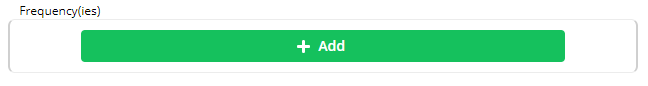
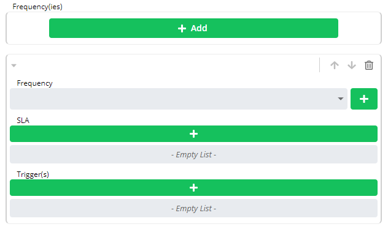
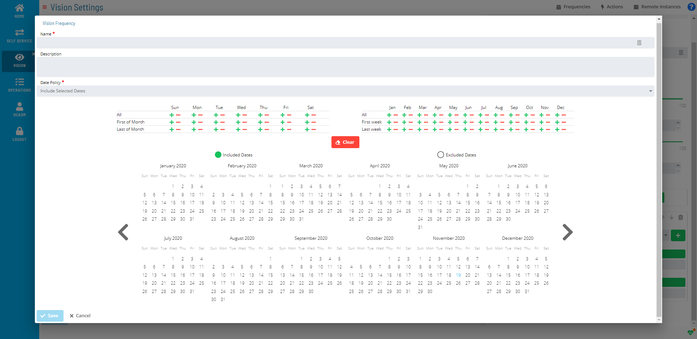

# Adding Vision Frequencies

**Theme:** Configure  
**Who Is It For?** System Administrator, Automation Engineer

## What Is It?

Use this procedure to add Vision Frequencies in Solution Manager.

To add a Vision Frequency, complete the following steps:

1. Complete the prior steps for either [Creating Cards](Creating-Cards.md) or [Editing Cards](Editing-Cards.md), depending on whether adding a frequency to a new or existing card
2. Select the **Add** button in the **Frequency(ies)** frame

   

   

3. Select the **+** button next to the **Frequency** list. The **Vision Frequency** window will display

   

4. Enter a *Name* for the frequency
5. *(Optional)* Enter a *Description*
6. Select a *dates option* from the **Date Policy** list
7. Select the **+** or **−** button to include or exclude dates, or select individual dates directly on the calendars
8. Select the **Save** button

## When Would You Use It?

- You need to add Vision Frequencies in Solution Manager
- The environment is expanding and requires additional Vision Frequencies to support new automation workflows

## Why Would You Use It?

- **Extend automation scope**: Adding Vision Frequencies to OpCon brings additional resources under centralized scheduling, monitoring, and event processing
- All additions are tracked in the OpCon audit log, recording who added the Vision Frequencies and when

## Defining SLA

:::note
A Vision license must define SLA. For more information, refer to [License File Request and Storing](Working-with-Vision.md#License) in the **Solution Manager** online help.
:::

a.  Select the **+** button under **SLA**.
b.  Select an *expected time option* from the **Requirement** list.
c.  Select the **Time**.
d.  Select the *day offset* in the **Day** list.
e.  Select **OK**.

## Defining Trigger(s)

:::note
A Vision license must define Triggers. For more information, refer to [License File Request and Storing](Working-with-Vision.md#License) in the **Solution Manager** online help.
:::

a.  Select the **+** button under **Trigger(s)**.
b.  Select a *status* from the **Status** list.
c.  Select the **+** button under **Runnable(s)**.
d.  Select the **+** button next to **Action**.
e.  Follow the procedure for [Adding Vision Actions](Adding-Vision-Actions.md) and save changes to return to the **Runnable(s)** frame.
f.  *(Optional)* Select a *number of minutes* in the **Repeat After** list.
g.  *(Optional)* Select a *remote instance* in the **Instance** list.
h.  Select **OK**.

On the **Vision Settings** page, select the **Save** button.

## FAQs

**Q: How do you save a new vision frequencies record?**

After completing the required fields, select the **Save** button on the toolbar to save the vision frequencies record.

**Q: Can you add vision frequencies for multiple platforms?**

Yes. This page covers vision frequencies for multiple platforms or contexts: Defining SLA, Defining Trigger(s).

## Glossary

**Solution Manager**: OpCon's browser-based graphical user interface for managing automation data, performing operational actions, and administering the system.

**Frequency**: A set of rules that defines when a job or schedule is eligible to run, based on calendar rules, day-of-week settings, period offsets, and other timing criteria.

**Calendar**: A named collection of dates in OpCon used by schedules and frequencies to determine when automation runs or is excluded. Calendars can represent holidays, working days, or any custom date set.

**Resource**: A numeric variable in OpCon representing a finite pool. Jobs can be configured to require a set number of resource units to run, limiting concurrent executions and preventing resource contention.
