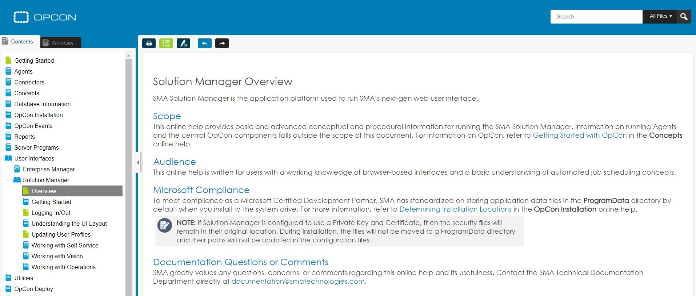

# Application Help

**Theme:** Configure  
**Who Is It For?** System Administrator, Automation Engineer

## What Is It?

Web-based help is available directly within the application, covering the entire OpCon product suite. Select the **Help** button  at the top of the page or press **Ctrl+Alt+H** to access content-specific topics or all product help.

:::note
You may need to disable your browser pop-up blocker to open help in the browser window.
:::

## When Would You Use It?

- Web-based help is available directly within the application, covering the entire OpCon product suite

## Why Would You Use It?

- **Application Help**: Web-based help is available directly within the application, covering the entire OpCon product suite

## Configuration Options

| Setting | What It Does | Default | Notes |
|---|---|---|---|
## FAQs

**Q: What does Application Help do?**

Web-based help is available directly within the application, covering the entire OpCon product suite. Select the **Help** button **: OpCon's rich client graphical user interface for Windows and Linux, used to define schedules and jobs, manage automation data, and perform operational tasks.

**Solution Manager**: OpCon's browser-based graphical user interface for managing automation data, performing operational actions, and administering the system.

**Resource**: A numeric variable in OpCon representing a finite pool. Jobs can be configured to require a set number of resource units to run, limiting concurrent executions and preventing resource contention.

**OpCon**: Continuous' workflow automation platform. The OpCon server includes the database, SAM and Supporting Services (SAM-SS), and graphical user interfaces. agents installed on target platforms run jobs and report results.
