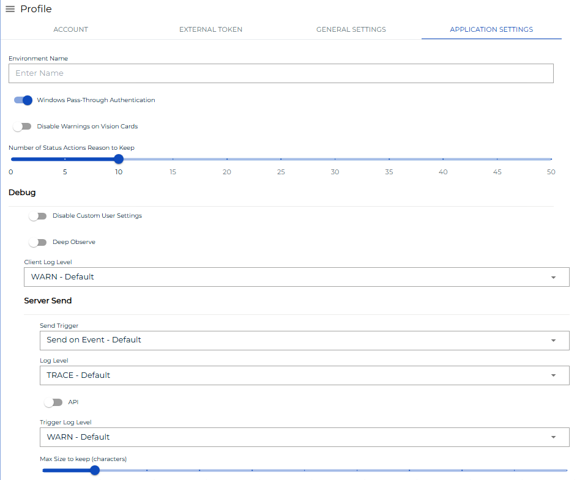
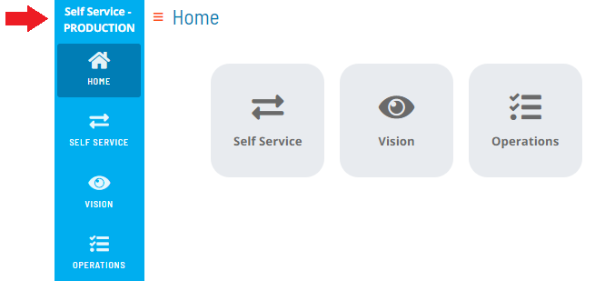
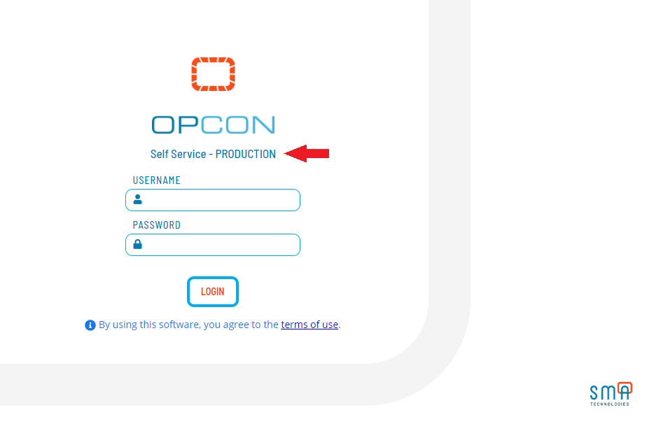

# Configuring Application Settings

**Theme:** Configure  
**Who Is It For?** System Administrator, Automation Engineer

## What Is It?

Use this procedure to configure Application Settings in Solution Manager.

:::note
The **Application Settings** tab is available only to users in the ocadm role.
:::

To configure application settings, complete the following steps:

1. Log into the Solution Manager
2. Select the **user profile** button in the **Navigation** menu

   

3. Select the **Application Settings** tab on the **Profile** page

   

4. Configure any of the following settings:
   - [Environment Names](#Environm)
   - [Windows Pass-Through Authentication](#Windows)
   - [Vision Card Warnings](#Vision)
   - [Status Actions Reason Caching](#Status)
   - [Debug](#Debug)

5. Select **Save** to save changes to the database

## Environment Names

Environment names label your OpCon environments for easy identification. Once defined, the name appears at the top of the [Navigation menu](SM-UI-Layout.md#Navigati) and on the [login screen](Logging-In.md#Solution_Manager_Login_Screen).

## Windows Pass-Through Authentication

This switch enables or disables Windows Authentication.

## Vision Card Warnings

Controls whether a Vision card enters a Warning state when jobs are in the Cancelled, Skipped, or Missed Start Time status. If disabled, those jobs are treated as finished without error or warning.

## Status Actions Reason Caching

Sets the number of Status Reasons cached in the **Change Status Reason** list for Job or Schedule status updates. For example, setting this to 10 stores the last 10 reasons entered.

## Debug

Configures global debugging for the application.

- **Disable Custom User Settings**: Controls whether users can define custom debug settings. If disabled, debug options are hidden from users
- **Customer Log Level**: Writes logs to the web browser console. Logs are local and lost when the browser closes
- **Deep Observe**: Enables a Framework event observe
- **Send Trigger**: Sets the trigger for sending server logs to the API server. Options:
  - **Disabled**: Disables the trigger
  - **Send on Interval and Max Size**: Interval- or size-driven trigger with these settings:
    - **Log Level**: Sets the server log level
    - **Api**: When enabled, logs all communications between the Customer and Server
    - **Interval (s)**: Sends logs at a set time interval (0–600 seconds)
    - **Max Size (characters)**: Sends logs when the accumulated size limit is reached (0–5000 kilobytes)
  - **Send on Event**: Event-driven trigger with these settings:
    - **Log Level**: Sets the server log level
    - **Api**: When enabled, logs all communications between the Customer and Server
    - **Trigger Log Level**: Sends logs when an ERROR or WARN occurs
    - **Max Size to keep (characters)**: Sends logs when the max size to keep limit is reached (0–5000 kilobytes)

:::note
To generate a temporary log file for the Support team when you can reproduce an issue, use the **InstantLog Mode** feature. Refer to [InstantLog Mode](SM-UI-Layout.md#InstantLog) for details.
:::

## Configuration Options

| Setting | What It Does | Default | Notes |
|---|---|---|---|
| Disable Custom User Settings | Controls whether users can define custom debug settings. | — | — |
| Customer Log Level | Writes logs to the web browser console. | — | — |
| Deep Observe | Enables a Framework event observe | — | — |
| Send Trigger | Sets the trigger for sending server logs to the API server. | — | — |

## FAQs

**Q: What does configuring application settings control?**

Configuring application settings defines the settings that determine how OpCon behaves for this feature. Review the available options and set values appropriate for your environment.

**Q: How many steps are required to configure application settings?**

The configuration procedure involves 5 steps. Complete all steps in order and select **Save** to apply the changes.

## Glossary

**Solution Manager**: OpCon's browser-based graphical user interface for managing automation data, performing operational actions, and administering the system.

**Resource**: A numeric variable in OpCon representing a finite pool. Jobs can be configured to require a set number of resource units to run, limiting concurrent executions and preventing resource contention.

**Role**: A named security profile in OpCon that groups privileges together. Roles are assigned to user accounts to control which features, schedules, jobs, machines, and administrative functions a user can access.

**Schedule**: A named container for jobs in OpCon, built for a specific date to create that day's automation. Schedules define build settings, frequencies, and the jobs that run within them.

**Job**: The fundamental unit of work in OpCon. A job defines what to run, on which machine, when to start, and what conditions must be met. Job results are tracked and can trigger events and notifications.

**OpCon**: Continuous' workflow automation platform. The OpCon server includes the database, SAM and Supporting Services (SAM-SS), and graphical user interfaces. agents installed on target platforms run jobs and report results.
