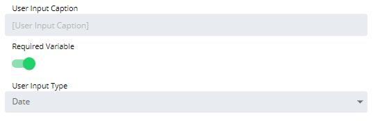

# Configuring Date User Inputs

**Theme:** Configure  
**Who Is It For?** System Administrator, Automation Engineer

## What Is It?

When configured, the Date User Input displays as a date picker (calendar) with validation rules when users run the Service Request.

To configure the user input, complete the following steps:

1. Select a User Input in the **User Inputs** list on the **Service Request definition** page, or select the blue **Edit** button next to the desired user input

   

2. The **Configure User Input** page displays

   

3. Enter the **User Input Caption** to display when users run the Service Request. The Variable name is used by default
4. Toggle the **Required Variable** switch to require a value for this field
5. Select **Date** in the **User Input Type** list
6. Select **OK** to confirm, or **Cancel** to discard changes and return to the **Service Request definition** page

#### Set a date range:

- **Start Date**: Specifies the earliest selectable date. Users cannot enter a date earlier than this value
  - **Today**: Toggle to set the current day as the **Start Date**
- **End Date**: Specifies the latest selectable date. Users cannot enter a date later than this value
  - **Today**: Toggle to set the current day as the **End Date**

#### Output format options:

- YYYY/MM/DD (2020/07/30)
- YYYY-MM-DD (2020-07-30)
- dddd MMMM D YYYY (Thursday July 30 2020)
- ddd MMMM D YYYY (Thu July 30 2020)
- MM/DD/YYYY (07/30/2020)
- M/D/YY (7/30/20)
- MMMM D YYYY (July 30 2020)

:::note
The date pattern format is based on the Javascript Moment format. The following patterns are not supported: **yo**, **N**, **NN**, **NNN**, **NNNN**, **NNNNN**, **y**, **yy**, **yyy**, **yyyy**. Refer to <https://momentjs.com/docs/#/displaying/format> for the official format reference.
:::

## Configuration Options

| Setting | What It Does | Default | Notes |
|---|---|---|---|
| Start Date | Specifies the earliest selectable date. | — | — |
| End Date | Specifies the latest selectable date. | — | — |

## FAQs

**Q: What does configuring date user inputs control?**

Configuring date user inputs defines the settings that determine how OpCon behaves for this feature. Review the available options and set values appropriate for your environment.

**Q: How many steps are required to configure date user inputs?**

The configuration procedure involves 6 steps. Complete all steps in order and select **Save** to apply the changes.

## Glossary

**Calendar**: A named collection of dates in OpCon used by schedules and frequencies to determine when automation runs or is excluded. Calendars can represent holidays, working days, or any custom date set.

**Service Request**: A Solution Manager feature that lets operators trigger predefined automation workflows using a simple form. Service Requests encapsulate schedule builds, job submissions, or events without requiring direct access to schedule definitions.

**Resource**: A numeric variable in OpCon representing a finite pool. Jobs can be configured to require a set number of resource units to run, limiting concurrent executions and preventing resource contention.

**OpCon**: Continuous' workflow automation platform. The OpCon server includes the database, SAM and Supporting Services (SAM-SS), and graphical user interfaces. agents installed on target platforms run jobs and report results.
