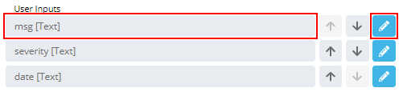
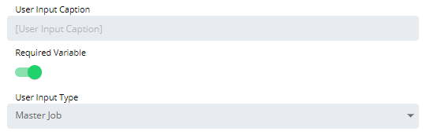

#  Configuring Master Job User Inputs

**Theme:** Configure  
**Who Is It For?** System Administrator, Automation Engineer

## What Is It?

When configured, the Master Job User Input displays as a list of all Master Jobs for which the logged-in user has privileges when running the Service Request.

To configure the user input, complete the following steps:

1. Select a User Input in the **User Inputs** list on the **Service Request definition** page, or select the blue **Edit** button next to the desired user input

   

2. The **Configure User Input** page displays

   

3. Enter the **User Input Caption** to display when users run the Service Request. The Variable name is used by default
4. Toggle the **Required Variable** switch to require a value for this field
5. Select **Job Master** in the **User Input Type** list
6. Select **OK** to confirm, or **Cancel** to discard changes and return to the **Service Request definition** page

## When Would You Use It?

- You need to adjust settings for Master Job User Inputs in Solution Manager
- Default Master Job User Inputs settings no longer meet the operational requirements of your environment

## Why Would You Use It?

- **Centralize control**: Managing Master Job User Inputs settings through Solution Manager keeps all configuration changes in one place and makes them auditable
- Settings validated through Solution Manager are checked against business rules before saving, reducing the risk of misconfiguration

## FAQs

**Q: What does configuring master job user inputs control?**

Configuring master job user inputs defines the settings that determine how OpCon behaves for this feature. Review the available options and set values appropriate for your environment.

**Q: How many steps are required to configure master job user inputs?**

The configuration procedure involves 6 steps. Complete all steps in order and select **Save** to apply the changes.

## Glossary

**Service Request**: A Solution Manager feature that lets operators trigger predefined automation workflows using a simple form. Service Requests encapsulate schedule builds, job submissions, or events without requiring direct access to schedule definitions.

**Resource**: A numeric variable in OpCon representing a finite pool. Jobs can be configured to require a set number of resource units to run, limiting concurrent executions and preventing resource contention.

**Privilege**: A specific permission granted through an OpCon role that controls access to a feature, function, or object type. Privileges are organized into categories such as Function Privileges, Machine Privileges, Schedule Privileges, and Access Codes.

**Job**: The fundamental unit of work in OpCon. A job defines what to run, on which machine, when to start, and what conditions must be met. Job results are tracked and can trigger events and notifications.

**OpCon**: Continuous' workflow automation platform. The OpCon server includes the database, SAM and Supporting Services (SAM-SS), and graphical user interfaces. agents installed on target platforms run jobs and report results.
