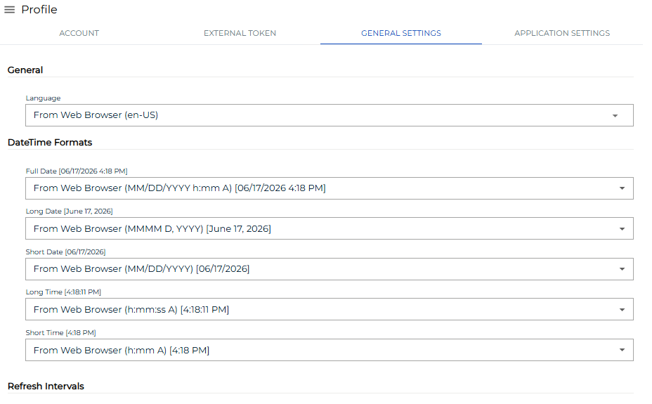

# Configuring Settings

**Theme:** Configure  
**Who Is It For?** System Administrator, Automation Engineer

## What Is It?

Use this procedure to configure Settings in Solution Manager.

To configure user settings, complete the following steps:

1. Log into the Solution Manager
2. Select the **user profile** button in the **Navigation** menu

3. Select the **Settings** tab on the **Profile** page

4. Configure any of the following settings:
   - [General](#General)
   - [DateTime Format](#DateTime)
   - [Refresh Intervals](#Refresh)
   - [Debug](#Debug)
5. Select **Save** to save the changes to the database

## General

The **General** section sets the application language. Available options:

- **From Web Browser**: Inherits the language settings of your web browser
- **EN**: Sets the language to English
- **FR**: Sets the language to French

## DateTime Format

The **DateTime** section configures the date and time formats used throughout Solution Manager. You can select a predefined format for:

- Full Date
- Long Date
- Short Date
- Long Time
- Short Time

## Refresh Intervals

The **Refresh Intervals** section sets the auto-refresh interval (0–600 seconds) for the following services:

- Application Status (s)
- Escalated Notification (s)
- Self Service (s)
- Self Service Execution (s)
- Vision Live (s)
- Operations Summary (s)
- Operations Processes (s)
- Operations Agents (s)
- Operations Graph
- Operations Schedule Build Queue

## Debug

:::note
The **Debug** section only appears if a member of the ocadm role has not disabled your ability to configure custom debug settings.
:::

The **Debug** section configures debugging via the **Global Settings** switch. When enabled, global debug settings from the ocadm role apply. When disabled, the following options become available:

- **Customer Log Level**: Writes logs to your web browser console. Logs are local and lost when the browser is closed
- **Deep Observe**: Enables a Framework event observe
- **Send Trigger**: Sets the trigger for sending server logs to the API server. Options:
  - **Disabled**: Disables the trigger
  - **Send on Interval and Max Size**: Sets an interval- or size-driven trigger with these settings:
    - **Log Level**: Sets the server log level
    - **Api**: When enabled, logs all communications (requests and responses) between the Customer and Server
    - **Interval (s)**: Sends logs at a set time interval (0–600 seconds)
    - **Max Size (characters)**: Sends logs when the accumulated character limit is reached (0–5000 characters)
  - **Send on Event**: Sets an event-driven trigger with these settings:
    - **Log Level**: Sets the server log level
    - **Api**: When enabled, logs all communications (requests and responses) between the Customer and Server
    - **Trigger Log Level**: Sends logs when an ERROR or WARN occurs
    - **Max Size to keep (characters)**: Sends logs when the max size to keep limit is reached (0–5000 kilobytes)

:::note
To reproduce an issue in the application, use the **InstantLog Mode** feature to generate a temporary log file for the Support team. Refer to [InstantLog Mode](SM-UI-Layout.md#InstantLog).
:::

## Configuration Options

| Setting | What It Does | Default | Notes |
|---|---|---|---|
| From Web Browser | Inherits the language settings of your web browser | — | — |
| EN | Sets the language to English | — | — |
| FR | Sets the language to French | — | — |
| Customer Log Level | Writes logs to your web browser console. | — | — |
| Deep Observe | Enables a Framework event observe | — | — |
| Send Trigger | Sets the trigger for sending server logs to the API server. | — | — |

## FAQs

**Q: What does configuring settings control?**

Configuring settings defines the settings that determine how OpCon behaves for this feature. Review the available options and set values appropriate for your environment.

**Q: How many steps are required to configure settings?**

The configuration procedure involves 5 steps. Complete all steps in order and select **Save** to apply the changes.

## Glossary

**Solution Manager**: OpCon's browser-based graphical user interface for managing automation data, performing operational actions, and administering the system.

**Notification**: A message sent by the SMA Notify Handler when a Machine, Schedule, or Job changes to a specific status. Notifications can be delivered as emails, text messages, Windows Event Log entries, SNMP traps, or other formats.

**Resource**: A numeric variable in OpCon representing a finite pool. Jobs can be configured to require a set number of resource units to run, limiting concurrent executions and preventing resource contention.

**Role**: A named security profile in OpCon that groups privileges together. Roles are assigned to user accounts to control which features, schedules, jobs, machines, and administrative functions a user can access.

**Schedule**: A named container for jobs in OpCon, built for a specific date to create that day's automation. Schedules define build settings, frequencies, and the jobs that run within them.

**OpCon**: Continuous' workflow automation platform. The OpCon server includes the database, SAM and Supporting Services (SAM-SS), and graphical user interfaces. agents installed on target platforms run jobs and report results.
