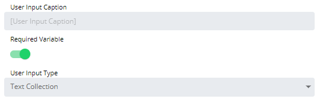

# Configuring Text Collection User Inputs

**Theme:** Configure  
**Who Is It For?** System Administrator, Automation Engineer

## What Is It?

When configured, the Text Collection User Input displays to users as a text box with validation rules when they run the Service Request.

To configure the user input, complete the following steps:

1. Select the specific User Input in the **User Inputs** list on the **Service Request definition** page, or select the blue **Edit** button next to the desired user input

2. The **Configure User Input** page displays

3. Enter the **User Input Caption** to display when users run the Service Request. By default, the Variable name is used
4. Toggle the **Required Variable** switch to require the user to input a value for this field
5. Select **Text Collection** in the **User Input Type** list
6. Select **OK** to confirm, or **Cancel** to discard changes and return to the **Service Request definition** page

#### Specify validation rules using the following options:

* **Restrict Duplicates**: Prevents users from entering the same value multiple times
* **Delimiter**: Specifies the character used to separate values when concatenated into a single string for injection into the OpCon Event
* **Minimum Characters**: Specifies a minimum character length restriction
* **Maximum Characters**: Specifies a maximum character length restriction
* **Invalid Characters**: Identifies any invalid \[restricted\] characters
* **Regular Expression**: Defines the following options:
  * **Regular Expression Pattern**: Builds a regex matcher pattern to validate the user's entry before injection
  * **Custom Error Message**: Defines an error message displayed when a regex validation exception occurs. For example: "Please enter a 10-digit phone number with hyphens (e.g., 281-446-5000)."

## Configuration Options

| Setting | What It Does | Default | Notes |
|---|---|---|---|
| Restrict Duplicates | Prevents users from entering the same value multiple times | — | — |
| Delimiter | Specifies the character used to separate values when concatenated into a single string for injection into the OpCon Event | — | — |
| Minimum Characters | Specifies a minimum character length restriction | — | — |
| Maximum Characters | Specifies a maximum character length restriction | — | — |
| Invalid Characters | Identifies any invalid \[restricted\] characters | — | — |
| Regular Expression | Defines the following options: | — | — |

## FAQs

**Q: What does configuring text collection user inputs control?**

Configuring text collection user inputs defines the settings that determine how OpCon behaves for this feature. Review the available options and set values appropriate for your environment.

**Q: How many steps are required to configure text collection user inputs?**

The configuration procedure involves 6 steps. Complete all steps in order and select **Save** to apply the changes.

## Glossary

**OpCon Event**: A command sent to OpCon that triggers an automated action, such as adding a job to a schedule, updating a property value, sending a notification, or changing a job or schedule status.

**Service Request**: A Solution Manager feature that lets operators trigger predefined automation workflows using a simple form. Service Requests encapsulate schedule builds, job submissions, or events without requiring direct access to schedule definitions.

**Resource**: A numeric variable in OpCon representing a finite pool. Jobs can be configured to require a set number of resource units to run, limiting concurrent executions and preventing resource contention.

**OpCon**: Continuous' workflow automation platform. The OpCon server includes the database, SAM and Supporting Services (SAM-SS), and graphical user interfaces. agents installed on target platforms run jobs and report results.
