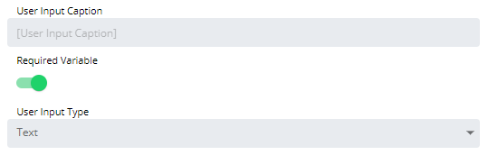

# Configuring Text User Inputs

**Theme:** Configure  
**Who Is It For?** System Administrator, Automation Engineer

## What Is It?

When configured, the Text User Input displays to users as a text box with validation rules when they run the Service Request.

To configure the user input, complete the following steps:

1. Select the specific User Input in the **User Inputs** list on the **Service Request definition** page, or select the blue **Edit** button next to the desired user input.

2. The **Configure User Input** page displays.

3. Enter the **User Input Caption** to display when users run the Service Request. By default, the Variable name is used.
4. Toggle the **Required Variable** switch to require the user to input a value for this field.
5. Select **Text** in the **User Input Type** list.
6. Select **OK** to confirm, or **Cancel** to discard changes and return to the **Service Request definition** page.

**Result:** The text user input is saved and will appear as a text box with the configured validation rules when users run the Service Request.

### Specify validation rules

Use the following options to define validation rules for the text input:

- **Secret**: Marks this field as a password or secret, masking the user's entry. Use this when injecting a password into OpCon Events (for example, a job instance property).
- **Minimum Characters**: Specifies a minimum character length restriction.
- **Maximum Characters**: Specifies a maximum character length restriction.
- **Invalid Characters**: Identifies any invalid (restricted) characters.
- **Regular Expression**: Defines the following options:
  - **Regular Expression Pattern**: Builds a regex matcher pattern to validate the user's entry before injection.
  - **Custom Error Message**: Defines an error message displayed when a regex validation exception occurs. For example: "Please enter a 10-digit phone number with hyphens (e.g., 281-446-5000)."

### Specify output formatting options

Use the following options to control how the value is formatted before being injected into the OpCon Event:

- **Characters to Strip**: Specifies which character(s) to remove from the User Input after validation.
- **Padding**: Specifies the padding direction (left/right), padding length, and padding character.

## Configuration Options

| Setting | What It Does | Default | Notes |
|---|---|---|---|
| Secret | Marks this field as a password or secret, masking the user's entry. | — | — |
| Minimum Characters | Specifies a minimum character length restriction. | — | — |
| Maximum Characters | Specifies a maximum character length restriction. | — | — |
| Invalid Characters | Identifies any invalid (restricted) characters. | — | — |
| Regular Expression | Validates the user's entry using a regex pattern. | — | — |
| Characters to Strip | Removes specified character(s) from the User Input after validation. | — | — |
| Padding | Specifies the padding direction (left/right), padding length, and padding character. | — | — |

## FAQs

**Q: What is the purpose of the Secret setting?**

The **Secret** setting masks the user's entry so it does not appear in plain text. Use it for passwords or other sensitive values that will be injected into OpCon Events.

**Q: When does the Required Variable switch apply?**

When the **Required Variable** switch is enabled, users must provide a value in the text box before they can submit the Service Request.

## Glossary

**OpCon Event**: A command sent to OpCon that triggers an automated action, such as adding a job to a schedule, updating a property value, sending a notification, or changing a job or schedule status.

**Service Request**: A Solution Manager feature that lets operators trigger predefined automation workflows using a simple form. Service Requests encapsulate schedule builds, job submissions, or events without requiring direct access to schedule definitions.

**Job**: The fundamental unit of work in OpCon. A job defines what to run, on which machine, when to start, and what conditions must be met. Job results are tracked and can trigger events and notifications.

**OpCon**: Continuous' workflow automation platform. The OpCon server includes the database, SAM and Supporting Services (SAM-SS), and graphical user interfaces. Agents installed on target platforms run jobs and report results.
