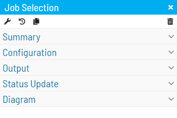

# Copying Daily Job Definitions to Master Job

## Required Privileges

In order to copy daily job definitions to master job, you must have the permissions to [View Daily Job](Accessing-Daily-Job-Definition.md) and [Update Master Job](Library\MasterJobs\Viewing-And-Updating-Master-Jobs\Accessing-Master-Jobs.md).

## Daily Job Definition

Refer to [Accessing Daily Job](Accessing-Daily-Job-Definition.md) for more information on accessing daily jobs page.

Upon enabling admin mode you will see a split button on the bottom left of your screen.

Clicking the arrow will display two different options:

**Push Changes to Master Job**:  
- Copy current daily job definitions to master job.

**Save Daily Job & push changes to Master Job**:  
- Save daily job and copy new job definitions to master job.

# Job Selection Right Panel

On the process page upon selecting a daily job and expanding the right panel you'll see a copy button.  
Clicking this button will perform the same action as **Push Changes to Master Job**.  

:::note
The split button will not be displayed if the selected daily job is a null or unsupported job type.  
In these cases you will see a Save button.
:::
