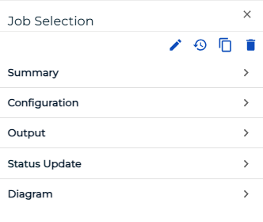

# Copying Daily Job Definitions to Master Job

**Theme:** Configure  
**Who Is It For?** System Administrator, Automation Engineer

## What Is It?

Use this procedure to copy Daily Job Definitions to Master Job in Solution Manager.

## When Would You Use It?

- An existing Daily Job Definitions to Master Job definition needs to be duplicated in Solution Manager
- A new Daily Job Definitions to Master Job with similar settings to an existing one needs to be created quickly

## Why Would You Use It?

- **Save configuration time**: Duplicating an existing Daily Job Definitions to Master Job eliminates redundant data entry and ensures the new definition inherits proven settings

## Administration

### Required Privileges

To copy daily job definitions to master job, you must have permissions to [View Daily Job](Accessing-Daily-Job-Definition.md) and [Update Master Job](Library\MasterJobs\Viewing-And-Updating-Master-Jobs\Accessing-Master-Jobs.md).

## Daily Job Definition

Refer to [Accessing Daily Job](Accessing-Daily-Job-Definition.md) for information on accessing the daily jobs page.

After enabling admin mode, a split button appears in the bottom-left of your screen.

Selecting the arrow displays two options:

- **Push Changes to Master Job**: Copies current daily job definitions to the master job
- **Save Daily Job & push changes to Master Job**: Saves the daily job and copies the new definitions to the master job

# Job Selection Right Panel

On the process page, selecting a daily job and expanding the right panel reveals a copy button. Selecting it performs the same action as **Push Changes to Master Job**.

:::note
The split button does not display if the selected daily job is a null or unsupported job type. In those cases, a Save button displays instead.
:::

## Configuration Options

| Setting | What It Does | Default | Notes |
|---|---|---|---|
| Push Changes to Master Job | Copies current daily job definitions to the master job | — | — |
| Save Daily Job & push changes to Master Job | Saves the daily job and copies the new definitions to the master job | — | — |

## FAQs

**Q: Why would you copy daily job definitions to master job instead of creating a new one?**

Copying daily job definitions to master job is useful when you want to reuse an existing configuration as a starting point. All settings from the original are duplicated, and you can then modify the copy as needed.

**Q: Does copying daily job definitions to master job require a new unique name?**

Yes. The copy must be saved with a new unique name to distinguish it from the original daily job definitions to master job record.

## Glossary

**Resource**: A numeric variable in OpCon representing a finite pool. Jobs can be configured to require a set number of resource units to run, limiting concurrent executions and preventing resource contention.

**Privilege**: A specific permission granted through an OpCon role that controls access to a feature, function, or object type. Privileges are organized into categories such as Function Privileges, Machine Privileges, Schedule Privileges, and Access Codes.

**Job**: The fundamental unit of work in OpCon. A job defines what to run, on which machine, when to start, and what conditions must be met. Job results are tracked and can trigger events and notifications.
