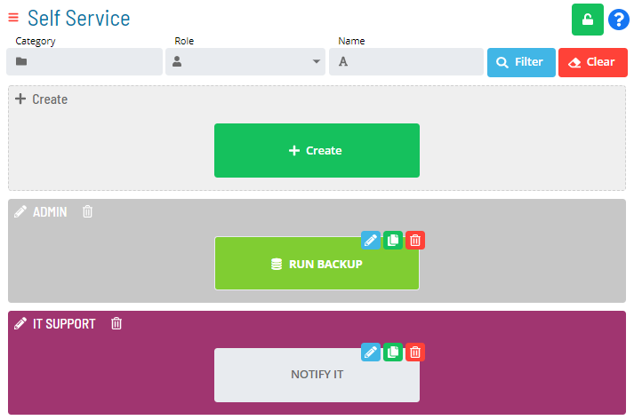
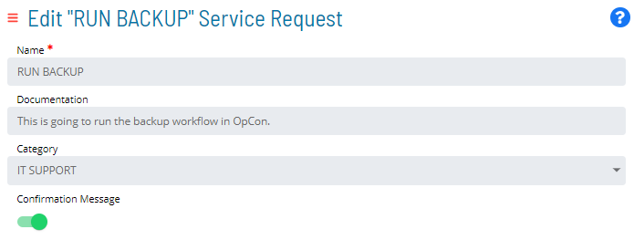

# Creating Categories

**Theme:** Configure  
**Who Is It For?** System Administrator, Automation Engineer

## What Is It?

You can group Service Requests into defined categories, such as a department or user group, and associate requests with that category.

To create and associate a category, complete the following steps:

1. Select the **+ Create** button
2. Enter a unique name. Use a naming convention that supports filtering (e.g., *Important/Saturday* lets you filter by "Saturday")
3. Select a background color. A reduced color swatch indicates the color is already in use
4. *(Optional)* Select one or more Service Requests to assign to the category. Each Service Request can belong to only one category at a time
5. Select **Save**. The new category displays

    

You can also edit a Service Request directly to change or set its category:

:::

## When Would You Use It?

- You need to create Categories in Solution Manager
- A new business process or automation requirement calls for a Categories that does not yet exist

## Why Would You Use It?

- **Standardize definitions**: Creating Categories in OpCon ensures consistent, repeatable configurations that all schedules and jobs can reference
- All Categories definitions are stored in the OpCon database, making them available to all authorized interfaces and users

## Configuration Options

| Setting | What It Does | Default | Notes |
|---|---|---|---|

## FAQs

**Q: How many steps does the Creating Categories procedure involve?**

The Creating Categories procedure involves 5 steps. Complete all steps in order and save your changes.

## Glossary

**Department**: An organizational grouping in OpCon used to assign jobs to logical divisions. User roles can be scoped to specific departments, controlling which jobs a user can manage.

**Service Request**: A Solution Manager feature that lets operators trigger predefined automation workflows using a simple form. Service Requests encapsulate schedule builds, job submissions, or events without requiring direct access to schedule definitions.

**Resource**: A numeric variable in OpCon representing a finite pool. Jobs can be configured to require a set number of resource units to run, limiting concurrent executions and preventing resource contention.
