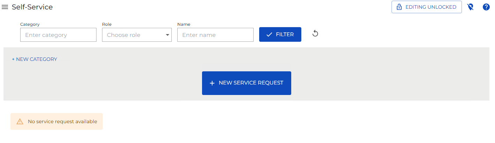
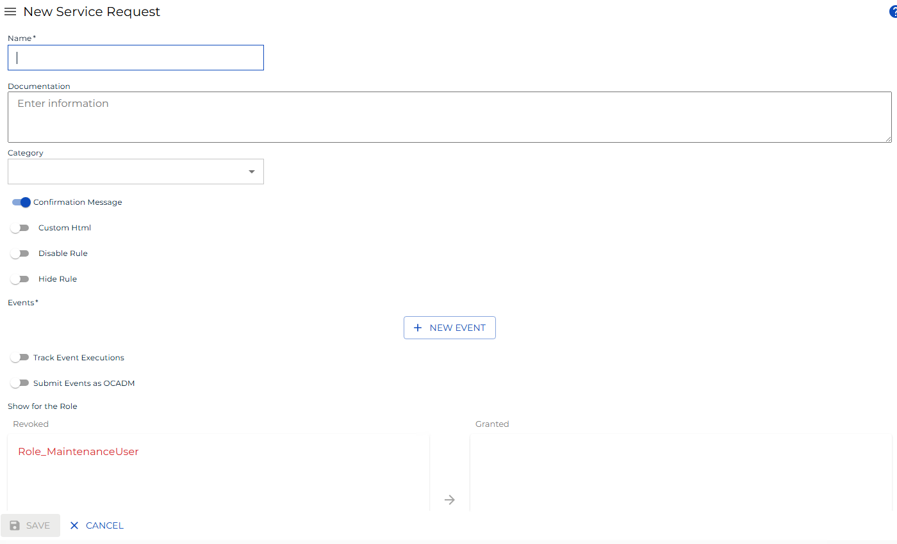

# Creating Service Requests

**Theme:** Configure  
**Who Is It For?** System Administrator, Automation Engineer

## What Is It?

Use this procedure to create Service Requests in Solution Manager.

To create a new service request, complete the following steps:

1. Select the **Create** button



2. Define the parameters (see below)
3. Select **Save** to display the button

:::info



:::

* **Name** ```(Required)```
  * The name displayed on the Service Request button
* **Documentation** ```(Optional)```
  * Instructions shown to users about what the Service Request does
* **Category** ```(Optional)```
  * Associates the Service Request with a pre-defined category
:::tip
Refer to [Creating Categories](Creating-Categories.md) for instructions.
:::
* **Confirmation Message** ```(Optional)```
  * When toggled on, shows the Documentation on the confirmation page when the button is selected
  * Must be set to ```True``` when a User Input (Environmental Variable) is defined
* **Custom HTML** ```(Optional)```
  * Customizes the HTML for the Service Request button display
:::tip
Refer to [Stylizing Service Request Buttons](Stylizing-Service-Requests.md#_Setting_Up_OpCon) for more detail.
:::
* **Disable Rule** ```(Optional)```
  * Defines a rule to disable the button after it is selected
:::tip
Refer to [Disabling or Hiding Service Request Buttons](Disabling_Hiding-Service-Requests.md) for instructions.
:::
* **Hide Rule** ```(Optional)```
  * Defines a rule to hide the button after it is selected
:::tip
Refer to [Disabling or Hiding Service Request Buttons](Disabling_Hiding-Service-Requests.md) for instructions.
:::
* **Events** ```(Required)```
  * Defines the OpCon Events initiated by the button
:::tip
Refer to [Setting up OpCon Events](Setting-up-OpCon-Events.md#_Setting_Up_OpCon) for more detail.
:::
* **Track Event Executions** ```(Optional)```
  * Monitors jobs dynamically added by the Service Request
  * Tracks $JOB:ADD jobs so users can verify successful completion
  * The Service Request completes only when all added jobs finish; if a job fails, the Service Request fails
* **Submit Events as OCADM** ```(Optional)```
  * Sends OpCon Events as **ocadm** (requires ocadm role)
  * Events proceed without privilege checks when enabled
  * When disabled, SAM checks the clicking user's privileges before processing events
* **User Inputs** ```(Optional)```
  * Variables defined in OpCon Events are automatically used as User Inputs
  * Displayed when the button is selected, allowing users to supply values for event variables
:::tip
Refer to [Setting up User Inputs](Setting-up-User-Inputs.md#_Setting_Up_User) for more detail.
:::
* **Show For Role**
  * Assigns the Service Request to one or more OpCon Roles
  * Only users in the granted roles can view and initiate the Service Request
:::tip
Refer to [Setting up Privileges](Setting-up-Privileges.md#_Setting_Up_Privileges) for more detail.
:::

## When Would You Use It?

- You need to create Service Requests in Solution Manager
- A new business process or automation requirement calls for a Service Requests that does not yet exist

## Why Would You Use It?

- **Standardize definitions**: Creating Service Requests in OpCon ensures consistent, repeatable configurations that all schedules and jobs can reference
- All Service Requests definitions are stored in the OpCon database, making them available to all authorized interfaces and users


## Exception Handling

**Track Event Executions job fails and the Service Request fails** — When the Track Event Executions option is enabled, a Service Request completes only when all added jobs finish; if any tracked job fails, the Service Request itself is marked as failed — Review the failed job's output and logs to determine the root cause, correct the job definition or data, and resubmit the Service Request.

**Confirmation Message is not set to True when a User Input is defined** — When a Service Request includes User Input fields (such as Environmental Variable inputs), the Confirmation Message setting must be True; if it is not set, the Service Request cannot be submitted correctly — Set the Confirmation Message option to True whenever one or more User Input definitions are present on the Service Request.

## FAQs

**Q: How many steps does the Creating Service Requests procedure involve?**

The Creating Service Requests procedure involves 3 steps. Complete all steps in order and save your changes.

## Glossary

**SAM (Schedule Activity Monitor)**: The logical processor for OpCon workflow automation. SAM monitors schedule and job start times, dependencies, and user commands to determine job execution timing, and processes OpCon events.

**OpCon Event**: A command sent to OpCon that triggers an automated action, such as adding a job to a schedule, updating a property value, sending a notification, or changing a job or schedule status.

**Service Request**: A Solution Manager feature that lets operators trigger predefined automation workflows using a simple form. Service Requests encapsulate schedule builds, job submissions, or events without requiring direct access to schedule definitions.

**Resource**: A numeric variable in OpCon representing a finite pool. Jobs can be configured to require a set number of resource units to run, limiting concurrent executions and preventing resource contention.

**Role**: A named security profile in OpCon that groups privileges together. Roles are assigned to user accounts to control which features, schedules, jobs, machines, and administrative functions a user can access.

**Privilege**: A specific permission granted through an OpCon role that controls access to a feature, function, or object type. Privileges are organized into categories such as Function Privileges, Machine Privileges, Schedule Privileges, and Access Codes.

**Job**: The fundamental unit of work in OpCon. A job defines what to run, on which machine, when to start, and what conditions must be met. Job results are tracked and can trigger events and notifications.

**OpCon**: Continuous' workflow automation platform. The OpCon server includes the database, SAM and Supporting Services (SAM-SS), and graphical user interfaces. agents installed on target platforms run jobs and report results.
