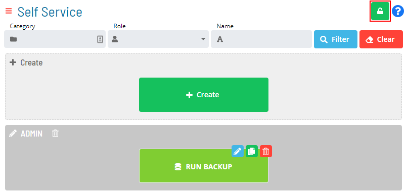

# Enabling Admin Mode Editing

**Theme:** Configure  
**Who Is It For?** System Administrator, Automation Engineer

## What Is It?

Use this procedure to enable Admin Mode Editing in Solution Manager.

To enable creating or editing Service Requests, select the **Admin Mode** button at the top-right corner:

### Admin Mode Editing Toggle Switch

The **Lock** button switches to unlocked and the Self Service page displays with editing privileges. See [Working in Admin Mode](Working-in-Admin-Mode.md) for details on those privileges.

### Admin Mode Editing Enabled

The **Admin Mode** button is only visible to users in the «ocadm» role or a role with the «Maintain Service Request» privilege.

:::note
For more on Function Privileges, refer to [Function Privileges](../../../administration/privileges.md#function-privileges) in the **Concepts** online help.
:::

## When Would You Use It?

- A Admin Mode Editing feature needs to be turned on in Solution Manager
- A scheduled change window or operational event requires activating Admin Mode Editing in a controlled manner

## Why Would You Use It?

- **Activate required functionality**: Enabling Admin Mode Editing activates the feature for the intended scope without affecting other parts of the system
- The change is recorded in the OpCon audit log, documenting when the Admin Mode Editing was activated and by whom

## Configuration Options

| Setting | What It Does | Default | Notes |
|---|---|---|---|

## FAQs

**Q: What is the purpose of enabling admin mode editing?**

Enabling Admin Mode Editing changes the state or access level for admin mode editing in OpCon.

## Glossary

**Service Request**: A Solution Manager feature that lets operators trigger predefined automation workflows using a simple form. Service Requests encapsulate schedule builds, job submissions, or events without requiring direct access to schedule definitions.

**Resource**: A numeric variable in OpCon representing a finite pool. Jobs can be configured to require a set number of resource units to run, limiting concurrent executions and preventing resource contention.

**Role**: A named security profile in OpCon that groups privileges together. Roles are assigned to user accounts to control which features, schedules, jobs, machines, and administrative functions a user can access.

**Privilege**: A specific permission granted through an OpCon role that controls access to a feature, function, or object type. Privileges are organized into categories such as Function Privileges, Machine Privileges, Schedule Privileges, and Access Codes.

**OpCon**: Continuous' workflow automation platform. The OpCon server includes the database, SAM and Supporting Services (SAM-SS), and graphical user interfaces. agents installed on target platforms run jobs and report results.
