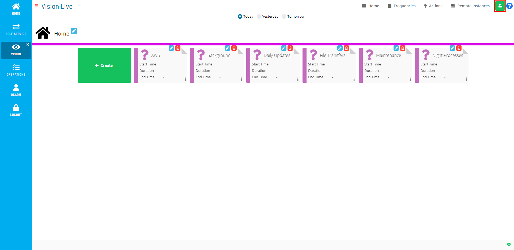

# Enabling Admin Mode Editing

**Theme:** Configure  
**Who Is It For?** System Administrator, Automation Engineer

## What Is It?

Use this procedure to enable Admin Mode Editing in Solution Manager.

To enable creating or editing Vision cards, frequencies, actions, or remote instances, select the **Admin Mode** button at the top-right corner:

Admin Mode Editing Toggle Switch

The **Lock** button switches to unlocked and the Vision Live page displays with editing privileges.

Admin Mode Editing Enabled

The **Admin Mode** button is only visible to users in the «ocadm» role or a role with the «Maintain Vision Workspaces» privilege.

:::note
For more on Function Privileges pertaining to Vision, refer to [Function Privileges](../../../administration/privileges.md#function-privileges) in the **Concepts** online help.
:::

## FAQs

**Q: What is the purpose of enabling admin mode editing?**

Enabling Admin Mode Editing changes the state or access level for admin mode editing in OpCon.

## Glossary

**Frequency**: A set of rules that defines when a job or schedule is eligible to run, based on calendar rules, day-of-week settings, period offsets, and other timing criteria.

**Resource**: A numeric variable in OpCon representing a finite pool. Jobs can be configured to require a set number of resource units to run, limiting concurrent executions and preventing resource contention.

**Role**: A named security profile in OpCon that groups privileges together. Roles are assigned to user accounts to control which features, schedules, jobs, machines, and administrative functions a user can access.

**Privilege**: A specific permission granted through an OpCon role that controls access to a feature, function, or object type. Privileges are organized into categories such as Function Privileges, Machine Privileges, Schedule Privileges, and Access Codes.

**OpCon**: Continuous' workflow automation platform. The OpCon server includes the database, SAM and Supporting Services (SAM-SS), and graphical user interfaces. agents installed on target platforms run jobs and report results.
