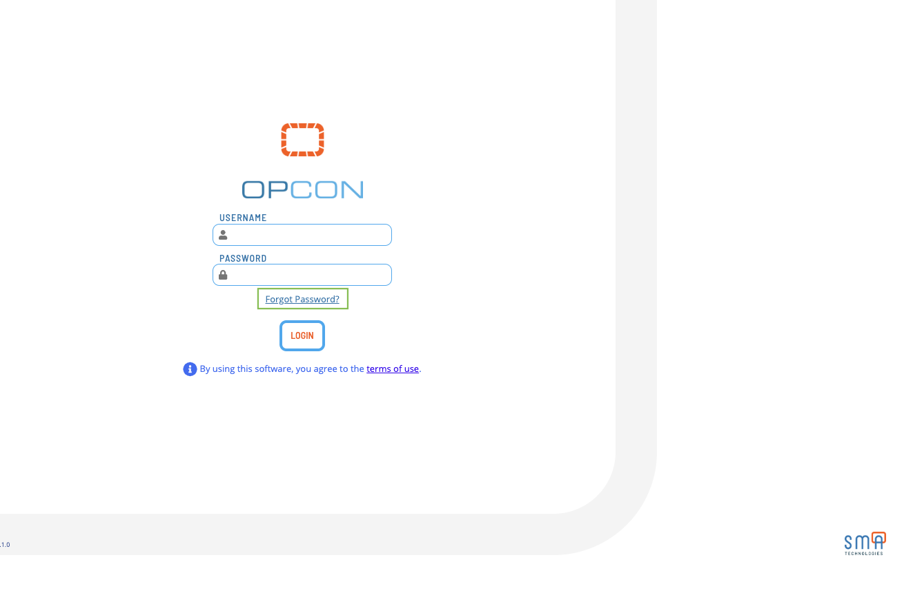
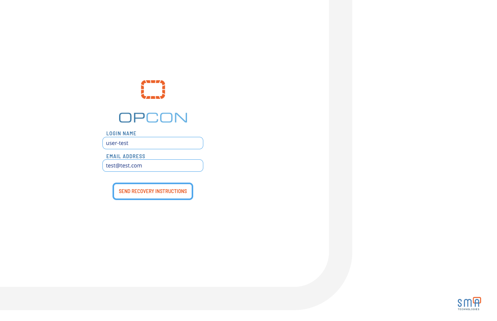
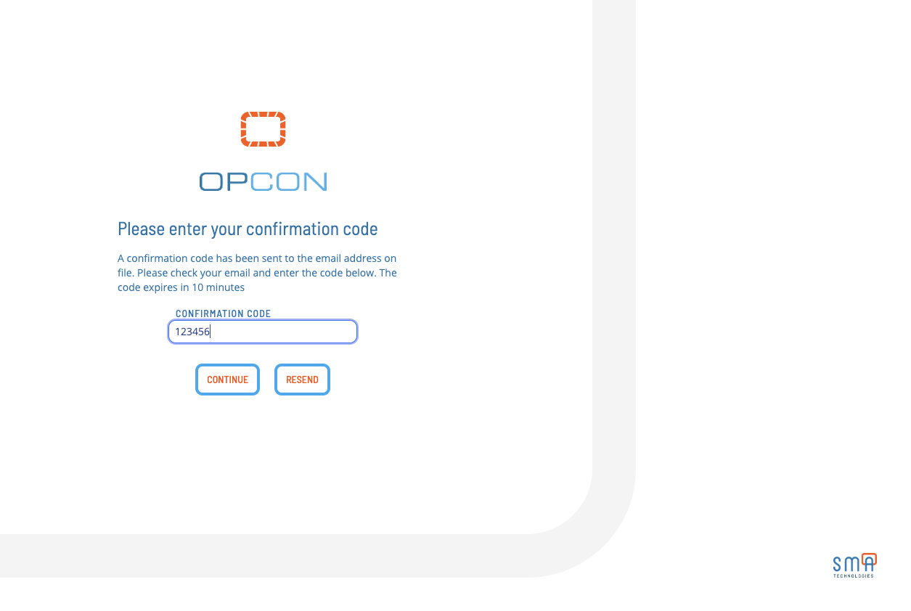
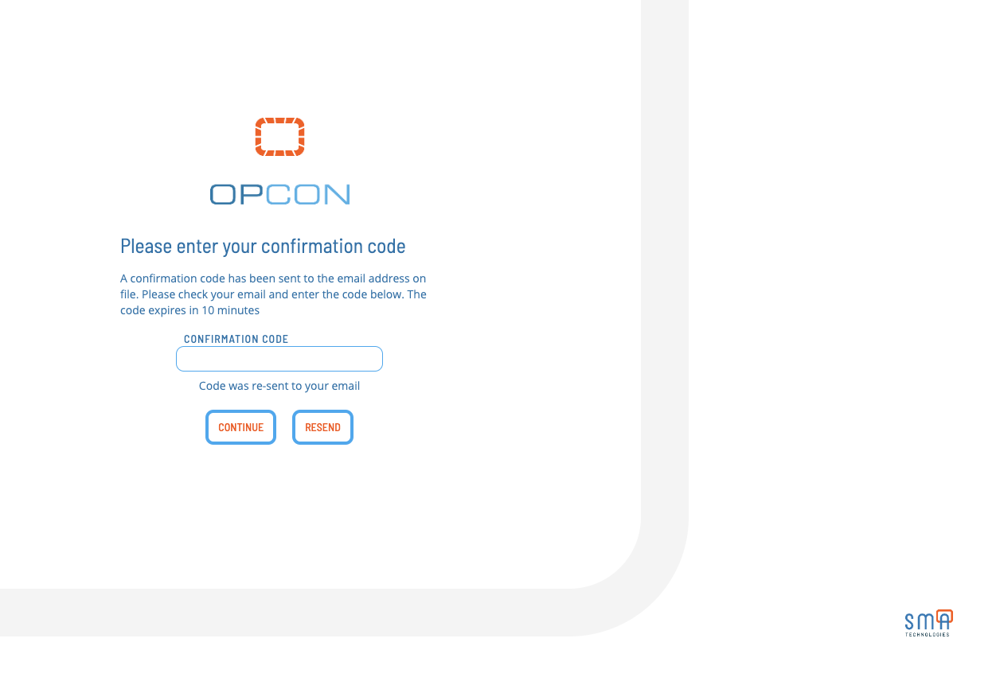
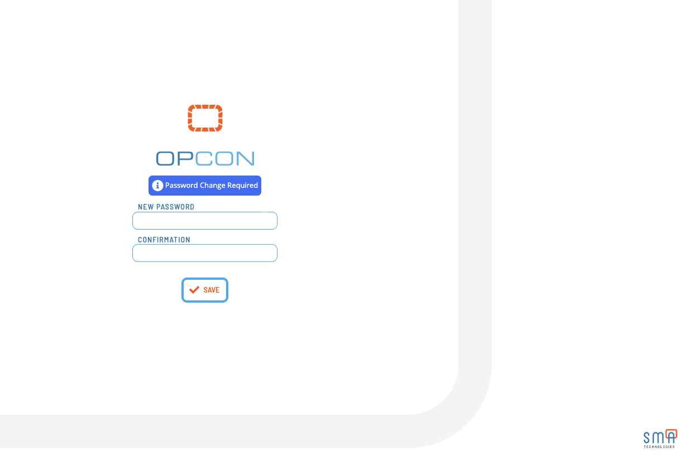

# Forgot / Reset Password

## Resetting Password

If a user forgot their password, they can reset it by clicking the **Forgot Password** link on the login screen.

:::note
The **Forgot Password** flow requires an active email (SMTP) server configuration. If the email server is not configured, the user will need to contact the OpCon administrator to reset their password.
:::

## Forgot Password Flow

1. Enter your **Login Name** and **Email Address** associated with your account. Click **Send Recovery Instructions**. This will send a 6 digit code to your email address if your login name and email matches a corresponding record.

:::note
This requires an active email (SMTP) server configuration. If the email server is not configured, the user will not receive an need to contact the OpCon administrator to reset their password. If you do not receive the email, check your spam folder. If you still do not receive the email, contact your OpCon administrator.
:::

2. After you receive the email, enter the 6 digit code in the **Verification Code** field and click **Submit**.

If you need to resend the email, click **Resend** and it will resend a code to the previously entered email address.

3. After submitting and verifying the code, you will be prompted to enter a new password. Enter and re-confirm your new password and click **Submit**.

Clicking **Submit** will verify your new password and log you into the application.
