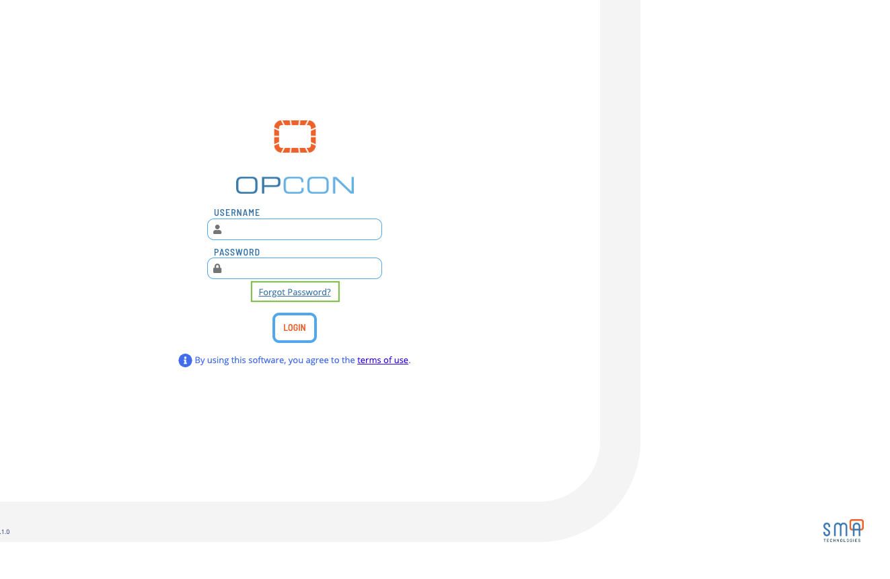
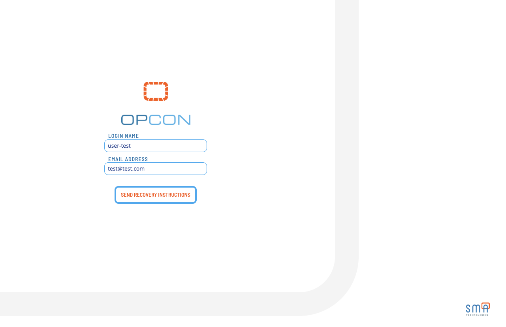
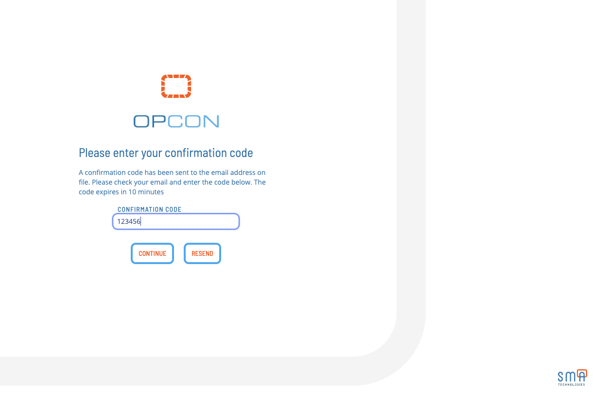
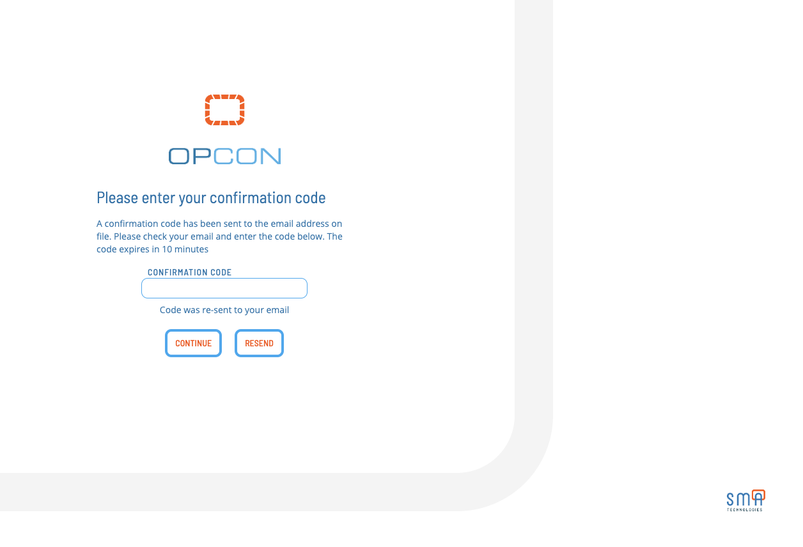
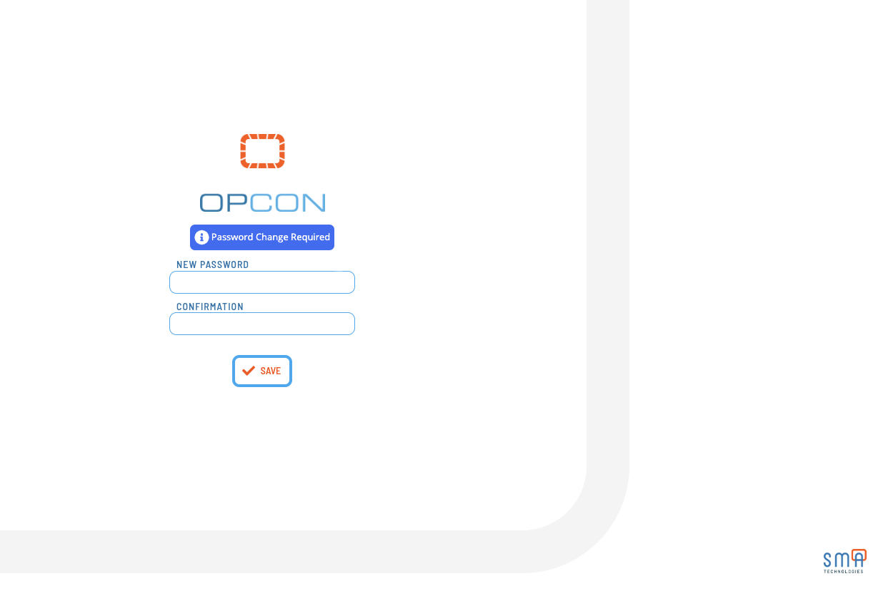

# Forgot / Reset Password

**Theme:** Configure  
**Who Is It For?** System Administrator, Automation Engineer

## What Is It?

The Forgot Password feature in Solution Manager lets users reset their own password without administrator intervention by selecting the Forgot Password link on the login screen and following the reset workflow.

## Resetting Password

If a user forgot their password, they can reset it by selecting the **Forgot Password** link on the login screen.

:::note
The **Forgot Password** flow requires an active email (SMTP) server configuration. If the email server is not configured, contact the OpCon administrator to reset the password.
:::

## Forgot Password Flow

To reset your password, complete the following steps:

1. Enter your **Login Name** and **Email Address**, then select **Send Recovery Instructions**. A 6-digit code is sent to your email if the login name and email match a record

:::note
This requires an active email (SMTP) server configuration. If you do not receive the email, check your spam folder. If you still do not receive it, contact your OpCon administrator.
:::

2. Enter the 6-digit code in the **Verification Code** field and select **Submit**

To resend the code, select **Resend**.

3. Enter and re-confirm your new password, then select **Submit**. The application verifies the password and logs you in

## Configuration Options

| Setting | What It Does | Default | Notes |
|---|---|---|---|
## FAQs

**Q: How many steps does the Forgot / Reset Password procedure involve?**

The Forgot / Reset Password procedure involves 3 steps. Complete all steps in order and save your changes.

**Q: What does Forgot / Reset Password cover?**

This page covers Resetting Password, Forgot Password Flow.

## Glossary

**Solution Manager**: OpCon's browser-based graphical user interface for managing automation data, performing operational actions, and administering the system.

**Resource**: A numeric variable in OpCon representing a finite pool. Jobs can be configured to require a set number of resource units to run, limiting concurrent executions and preventing resource contention.

**OpCon**: Continuous' workflow automation platform. The OpCon server includes the database, SAM and Supporting Services (SAM-SS), and graphical user interfaces. agents installed on target platforms run jobs and report results.
