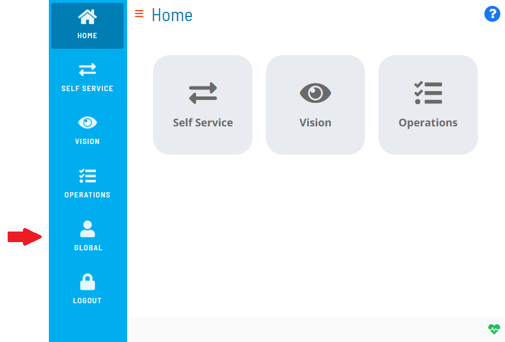
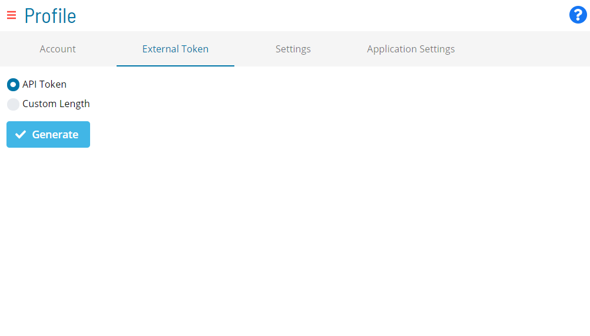

# Generating External Tokens

**Theme:** Configure  
**Who Is It For?** System Administrator, Automation Engineer

## What Is It?

An external token and a valid OpCon User Login ID are required to run an external event. External tokens can be generated in Solution Manager as either API tokens or Custom Length tokens.

To generate external tokens, complete the following steps:

1. Log into Solution Manager
2. Select the **user profile** button in the **Navigation** menu

3. Select the **External Token** tab on the **Profile** page

4. Select a token type:
   - **API Token**: Generates a token that can also be used for API authentication
   - **Custom Length**: Sets the token length (8–35 characters). This token cannot be used for API authentication

5. Select **Generate**

## When Would You Use It?

- A new External Tokens needs to be produced in Solution Manager

## Why Would You Use It?

- **Generating External**: An external token and a valid OpCon User Login ID are required to run an external event

## Configuration Options

| Setting | What It Does | Default | Notes |
|---|---|---|---|
## FAQs

**Q: How many steps does the Generating External Tokens procedure involve?**

The Generating External Tokens procedure involves 5 steps. Complete all steps in order and save your changes.

## Glossary

**Solution Manager**: OpCon's browser-based graphical user interface for managing automation data, performing operational actions, and administering the system.

**Token (Global Property)**: A named value stored in the OpCon database, referenced in job definitions and events using [[PropertyName]] syntax. Tokens pass dynamic values — such as dates, file paths, or counts — into automation workflows.

**Resource**: A numeric variable in OpCon representing a finite pool. Jobs can be configured to require a set number of resource units to run, limiting concurrent executions and preventing resource contention.

**OpCon**: Continuous' workflow automation platform. The OpCon server includes the database, SAM and Supporting Services (SAM-SS), and graphical user interfaces. agents installed on target platforms run jobs and report results.
