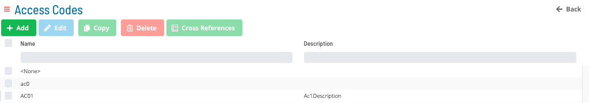
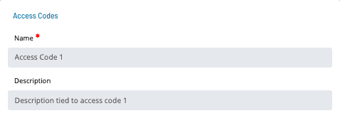
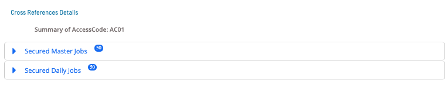
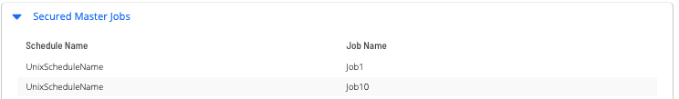
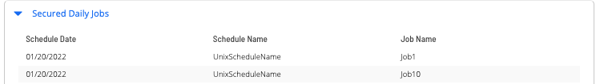

# Access Codes

Available Access Codes in OpCon are shown in the following Grid under Library -> Access Codes.

Clicking the **Add**, **Copy** or **Edit** button bring up the following dialog:

:::note
The **Name** field is unique across Access Codes, Resources _and_ Thresholds
:::

Click the Cross References button to see the list of master and daily jobs that use a particular Access Code.

Click on the expansion arrow for **Secured Master Job** to view a list of master jobs that use the selected access code.

Click on the expansion arrow for **Secured Daily Job** to view a list of daily jobs that use the selected access code.

