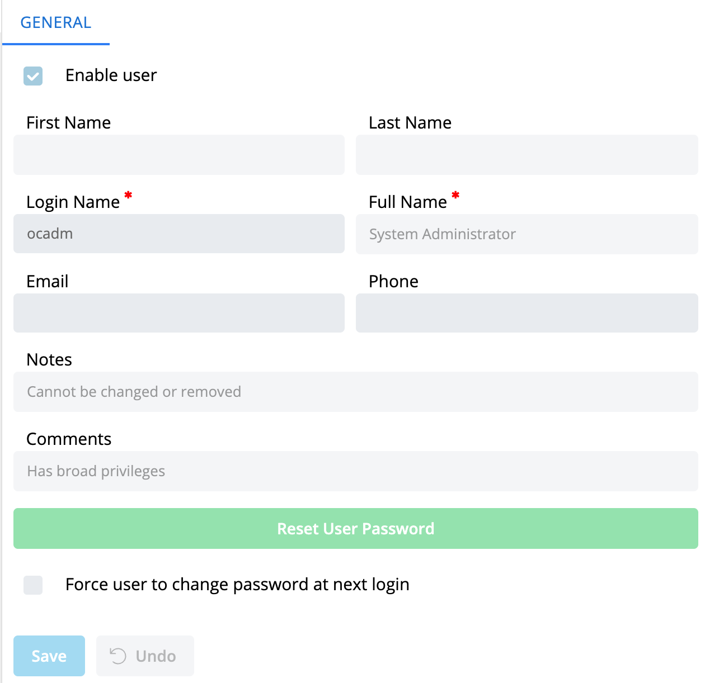

# User General

The Users page is found in _Library > Access Management > Users_, and provides the views to manage Users. When you click on the Users tab, you will see a list of all the users that have been created in the system. You can click on the name of a user to view and modify the details of that user.

A series of tabs is displayed on the Users page. The General tab displays the general information about the selected user. The General tab provides a **Reset User Password** button to reset the selected user's password and optionally to copy it to the clipboard.

:::note
Email is required if Server Options -> Security -> "Ask user to enter a recovery email address upon login" is enabled.
:::

To modify a User, edit the preferred fields and click **Save**.

---

For more information see:

- [Managing Users](../Managing-Users.md)

For conceptual help, see:

- [Users](../../../../../../../administration/user-accounts.md)
