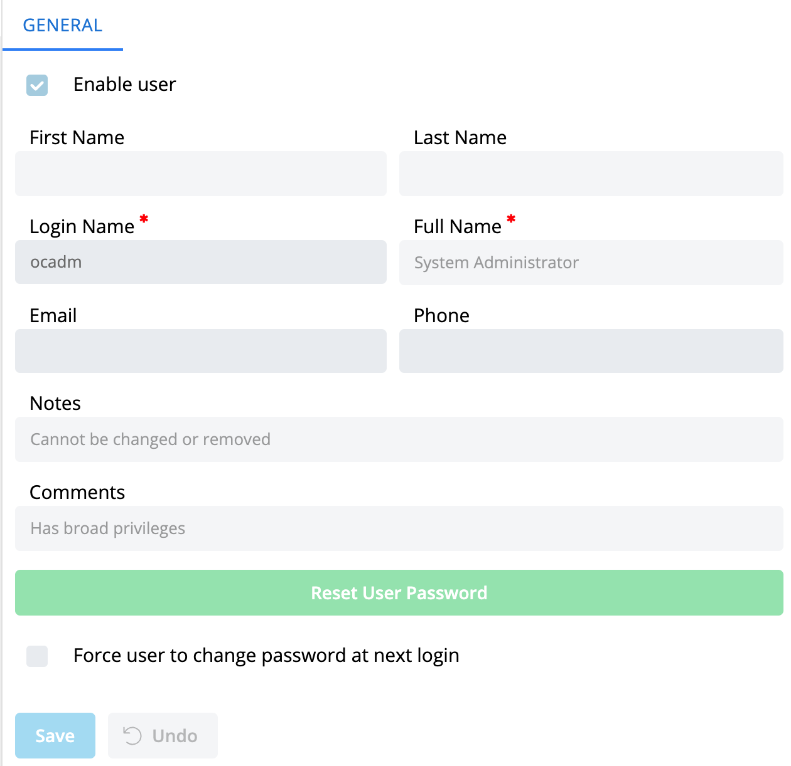

# User General

**Theme:** Configure  
**Who Is It For?** System Administrator, Automation Engineer

## What Is It?

The Users page is found in _Library > Access Management > Users_. The General tab displays general information about the selected user and provides a **Reset User Password** button to reset the user's password and optionally copy it to the clipboard.

:::note
Email is required if Server Options -> Security -> "Ask user to enter a recovery email address upon login" is enabled.
:::

To modify a user, edit the preferred fields and select **Save**.

---

For more information see:

- [Managing Users](../Managing-Users.md)

For conceptual help, see:

- [Users](../../../../../../../administration/user-accounts.md)

## When Would You Use It?

- The Users page is found in _Library > Access Management > Users_

## Why Would You Use It?

- **Operational value**: Provides a Reset User Password button to reset the user's password and optionally copy it

## Configuration Options

| Setting | What It Does | Default | Notes |
|---|---|---|---|
## FAQs

**Q: What does User General do?**

title: Users - General

**Q: Where can you find User General in OpCon?**

Access User General through the appropriate section in the Enterprise Manager or Solution Manager navigation.

## Glossary

**Enterprise Manager (EM)**: OpCon's rich client graphical user interface for Windows and Linux, used to define schedules and jobs, manage automation data, and perform operational tasks.

**Solution Manager**: OpCon's browser-based graphical user interface for managing automation data, performing operational actions, and administering the system.

**Resource**: A numeric variable in OpCon representing a finite pool. Jobs can be configured to require a set number of resource units to run, limiting concurrent executions and preventing resource contention.

**OpCon**: Continuous' workflow automation platform. The OpCon server includes the database, SAM and Supporting Services (SAM-SS), and graphical user interfaces. agents installed on target platforms run jobs and report results.
