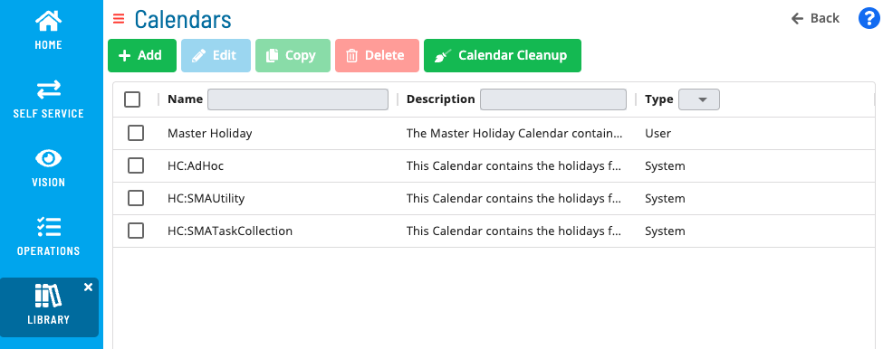

# Managing Calendars

**Theme:** Configure  
**Who Is It For?** System Administrator, Automation Engineer

## What Is It?

The **Calendars** page is used to define and maintain OpCon Calendars and displays a list of existing calendars. For conceptual information, refer to [Calendars](../../../../../objects/calendars.md) in the **Concepts** online help.

## When Would You Use It?

- You need to review or update Calendars settings in Solution Manager
- Calendars needs to be reviewed as part of routine system maintenance or a compliance audit

## Why Would You Use It?

- **Reduce administrative overhead**: Centralizing Calendars management in Solution Manager reduces the time needed to locate and update settings across the environment
- All Calendars changes are captured in the OpCon audit system, supporting change management and compliance processes

## Calendars Toolbar

The **Calendars** page has a toolbar for managing calendars.

Related Topics

- [Adding Calendars](Adding-Calendars.md)
- [Calendar Cleanup](Calendar-Cleanup.md)
- [Copying Calendars](Copying-Calendars.md)
- [Deleting Calendars](Deleting-Calendars.md)
- [Editing Calendars](Editing-Calendars.md)

## Configuration Options

| Setting | What It Does | Default | Notes |
|---|---|---|---|

## FAQs

**Q: What does managing calendars involve?**

Managing calendars includes Calendars Toolbar. Access calendars through the Enterprise Manager navigation pane.

**Q: Who can manage calendars in OpCon?**

Users with the appropriate privileges assigned through their role can manage calendars. Contact your OpCon system administrator if you do not have access.

## Glossary

**Enterprise Manager (EM)**: OpCon's rich client graphical user interface for Windows and Linux, used to define schedules and jobs, manage automation data, and perform operational tasks.

**Calendar**: A named collection of dates in OpCon used by schedules and frequencies to determine when automation runs or is excluded. Calendars can represent holidays, working days, or any custom date set.

**Resource**: A numeric variable in OpCon representing a finite pool. Jobs can be configured to require a set number of resource units to run, limiting concurrent executions and preventing resource contention.

**Role**: A named security profile in OpCon that groups privileges together. Roles are assigned to user accounts to control which features, schedules, jobs, machines, and administrative functions a user can access.

**Privilege**: A specific permission granted through an OpCon role that controls access to a feature, function, or object type. Privileges are organized into categories such as Function Privileges, Machine Privileges, Schedule Privileges, and Access Codes.

**OpCon**: Continuous' workflow automation platform. The OpCon server includes the database, SAM and Supporting Services (SAM-SS), and graphical user interfaces. agents installed on target platforms run jobs and report results.
