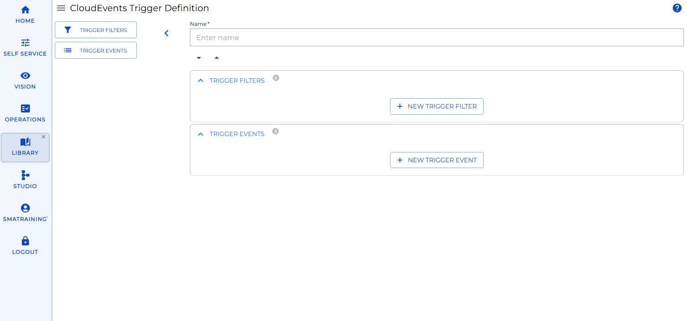
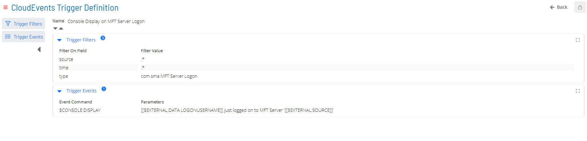
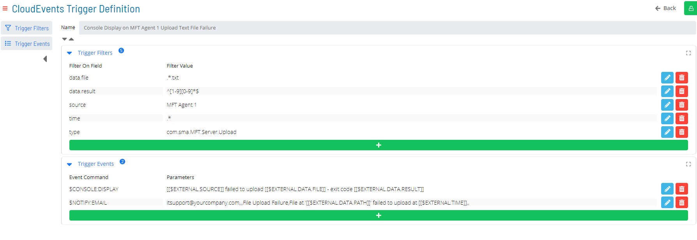

# CloudEvents Triggers

**Theme:** Configure  
**Who Is It For?** System Administrator, Automation Engineer

## What Is It?

The **CloudEvents Triggers** module allows you to trigger Events within OpCon via externally-produced 'trigger events' which adhere to the [CloudEvents Specification](https://cloudevents.io/).

This module is used exclusively to manage triggering Events in OpCon when certain events happen on the OpCon MFT Server. For details, refer to [MFT Server Triggers](https://help.smatechnologies.com/opcon/agents/opconmft/server-triggers).

### CloudEvents Trigger Format
A CloudEvents Trigger definition has two components: `Trigger Filters` and `Trigger Events`.



#### Trigger Filters
The `Trigger Filters` component lists all criteria an incoming trigger event must satisfy to activate the CloudEvents Trigger. Criteria use string-based Regular Expression matching against trigger event payload fields. Each filter criterion has a **Filter Field** (the payload attribute identifier) and a **Filter Value** (the Regular Expression to evaluate).

Use dot-notation for the Field identifier to reference nested data attributes. For example, given:
```
{
  type: 'com.example.exemplarEvent',
  data: {
    'resultCode': 0
  }
}
```
The Field identifier for `type` is `type`; for `resultCode`, it is `data.resultCode`.

> Tip: If a filter criterion targets the `type` field with a known Filter Value from the selection list, Solution Manager provides contextual suggestions based on known trigger event schemas.

A CloudEvents Trigger may contain any number of filter criteria, including none:
- A trigger with no filters activates on every incoming trigger event
- A trigger with one filter (e.g., on `source`) activates for every event from that source
- When multiple criteria are included, all must pass for the trigger to activate

To trigger on any one of several criteria (OR logic), use the `Copy` functionality to create separate CloudEvents Trigger definitions, each with its own subset of criteria.

#### Trigger Events
The `Trigger Events` component lists all OpCon Events queued for processing when an incoming trigger event satisfies all filter criteria. For more information, see [OpCon Events](https://help.smatechnologies.com/opcon/core/events/introduction).

When configuring OpCon Events in this module, select the magic wand icon next to any Property field to open the Property Selector Dialog. This dialog includes `$EXTERNAL` Properties corresponding to attributes of the incoming trigger event. If a recognized `type` filter is associated with the Trigger Definition, additional `$EXTERNAL.DATA` Properties align with known attributes in the trigger event's data payload. Any `$EXTERNAL` Property is replaced with the corresponding value from the external triggering event during processing.

### Trigger Events Data Format (CloudEvents)

This module implements the CloudEvents specification for defining and consuming trigger events. The full specification is available [here](https://github.com/cloudevents/spec/blob/main/cloudevents/spec.md#overview).

Events are published in JSON format with the following fields:

| Field Name | Description | Type | Required |
| --------------- | -------------------------------------------------------------------- | --------- | -------- |
| id | A unique identifier for the event | string | :white_check_mark: |
| source | An identifier for the context in which the event occurred | URI | :white_check_mark: |
| specversion | The version of CloudEvents specification implemented by the producer | string | :white_check_mark: |
| type | Describes the type of event - defined by the producer | string | :white_check_mark: |
| data | Domain-specific information about this event | string | :x: |
| datacontenttype | Describes the data type of any included event data | string | :x: |
| dataschema | Identifies the schema which any included event data adheres to | URI | :x: |
| subject | Identifies the subject of the event, if any | string | :x: |
| time | Timestamp of when the event occurred | timestamp | :x: |

Events may also include Extension Attributes. The `data` attribute contains domain-specific event information; `datacontenttype` and `dataschema` describe its encoding and structure.

If `datacontenttype` is `application/json` and a JSON schema is provided in `dataschema`, the module provides contextual hinting in the interface and schema validation at the API.

### Filtering Incoming Trigger Events
When a trigger event is submitted to the Solution Manager API, it is queued for processing against all defined CloudEvents Triggers. Each defined trigger is evaluated in turn:
- All filters associated with the CloudEvents Trigger are applied to the trigger event
- Only if every filter matches will the associated OpCon Events be queued for execution
- If the trigger event matches multiple CloudEvents Triggers, each matching trigger queues its own OpCon Events for execution

Filters are not guaranteed to evaluate in sequential order, and OpCon Events are not guaranteed to run in the order displayed. When multiple CloudEvents Triggers match, all their OpCon Events run in arbitrary order.

### Examples

#### User Logon Alert


This CloudEvents Trigger displays a console message whenever an OpCon MFT Server user logs on. The `source` and `time` fields use `.*` (accept any input) as Filter Values and do not affect whether the trigger activates. The `$EXTERNAL` property identifiers provide contextual information to the display message.

Note: The `type` filter value `com.sma.MFT.Server.Logon` and the list label `MFT Server Logon` are equivalent; either can be entered. The same applies to all other known types.

##### *Matching Trigger Event*
```
{
  "source": "MFT Agent 1",
  "type": "com.sma.MFT.Server.Logon",
  "data": {
    "logonUserName": "User1",
    ...
  },
  ...
}
```

##### *Non-Matching Trigger Event*
```
{
  "source": "MFT Agent 1",
  "type": "com.sma.MFT.Server.Logoff",
  "data": {
    "logonUserName": "User1",
    ...
  },
  ...
}
```

#### Display Message When Text File Upload from Server Fails


This CloudEvents Trigger displays a console message and sends a notification email whenever the Server component of MFT Agent 1 fails to upload a `.txt` file.

Note: The `type` filter value `com.sma.MFT.Server.Logon` and the list label `MFT Server Logon` are equivalent; either can be entered. The same applies to all other known types.

##### *Matching Trigger Event*
```
{
  "source": "MFT Agent 1",
  "type": "com.sma.MFT.Server.Upload",
  "data": {
    "file": "readme.txt",
    "result": 5,
    ...
  },
  ...
}
```

##### *Non-Matching Trigger Events*
```
{
  "source": "MFT Agent 2",
  "type": "com.sma.MFT.Server.Upload",
  "data": {
    "file": "readme.txt",
    "result": 0,
    ...
  },
  ...
},
{
  "source": "MFT Agent 1",
  "type": "com.sma.MFT.Server.Download",
  "data": {
    "file": "readme.txt",
    "result": 0,
    ...
  },
{
  "source": "MFT Agent 1",
  "type": "com.sma.MFT.Server.Upload",
  "data": {
    "file": "readme.txt",
    "result": 0,
    ...
  },
  ...
}
{
  "source": "MFT Agent 1",
  "type": "com.sma.MFT.Server.Upload",
  "data": {
    "file": "readme",
    "result": 10,
    ...
  },
  ...
}
  ...
}
```

## Configuration Options

## FAQs

**Q: What does CloudEvents Triggers do?**

The **CloudEvents Triggers** module allows you to trigger Events within OpCon via externally-produced 'trigger events' which adhere to the [CloudEvents Specification](https://cloudevents.io/).

**Q: Where can you find CloudEvents Triggers in OpCon?**

Access CloudEvents Triggers through the appropriate section in the Enterprise Manager or Solution Manager navigation.

## Glossary

**Enterprise Manager (EM)**: OpCon's rich client graphical user interface for Windows and Linux, used to define schedules and jobs, manage automation data, and perform operational tasks.

**Solution Manager**: OpCon's browser-based graphical user interface for managing automation data, performing operational actions, and administering the system.

**OpCon Event**: A command sent to OpCon that triggers an automated action, such as adding a job to a schedule, updating a property value, sending a notification, or changing a job or schedule status.

**Notification**: A message sent by the SMA Notify Handler when a Machine, Schedule, or Job changes to a specific status. Notifications can be delivered as emails, text messages, Windows Event Log entries, SNMP traps, or other formats.

**Resource**: A numeric variable in OpCon representing a finite pool. Jobs can be configured to require a set number of resource units to run, limiting concurrent executions and preventing resource contention.

**OpCon**: Continuous' workflow automation platform. The OpCon server includes the database, SAM and Supporting Services (SAM-SS), and graphical user interfaces. agents installed on target platforms run jobs and report results.
