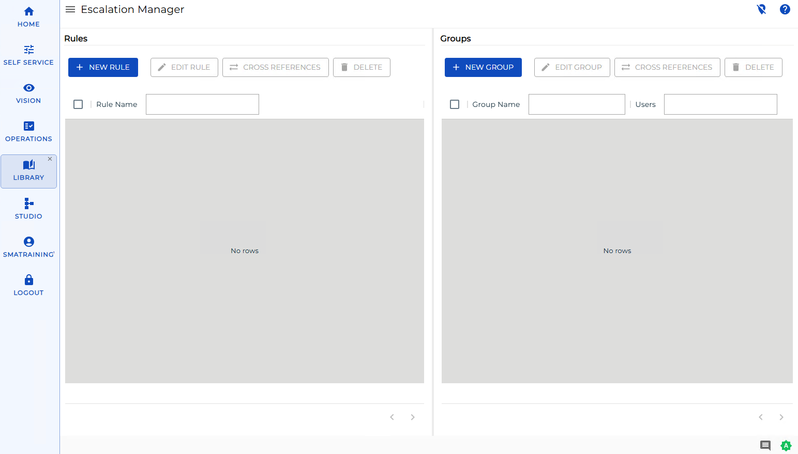

# Escalation Manager

**Theme:** Overview
**Who Is It For?** System Administrator, Automation Engineer

## What Is It?

**Escalation Manager** lets you control what happens when an OpCon notification is not acknowledged within a defined time. You define **Escalation Rules** that set the timing and sequence of repeated notifications, and **Escalation Groups** that define who receives them.

When a notification linked to an escalation rule is not acknowledged, OpCon advances through the rule's ordered sequences. Each sequence notifies a selected escalation group, waits the configured **Time between Notifications**, and repeats up to the configured **Number of Times to be Notified** before moving to the next sequence. Recipients clear an escalation through **Escalation Acknowledgment**; an escalation that has run through all of its notifications without acknowledgment is marked **EXHAUSTED**.

:::note
Use the bar on the left side of the screen to switch between **Rules** and **Groups**.
:::

Use Escalation Manager to:

- Make sure a critical alert is not missed when the first recipient does not respond
- Set up an on-call notification chain that widens to more people over time
- Manage which users receive escalated notifications and how often they are notified

## What Is in This Section?

| Page | Description |
| --- | --- |
| [Managing Escalation Rules](Managing-Escalation-Rules.md) | Add, edit, delete, and check cross-references for the rules that set escalation timing and sequence |
| [Managing Escalation Groups](Managing-Escalation-Groups.md) | Add, edit, delete, and check cross-references for the recipient groups used in escalation rules |

:::note
At least one escalation group must exist before you can create an escalation rule.
:::

## FAQs

**Q: Where do you find Escalation Manager in OpCon?**

You can manage escalations in Solution Manager or in Enterprise Manager.

**Q: What is the difference between an escalation rule and an escalation group?**

An escalation rule sets the timing and the order in which recipients are notified. An escalation group is a named set of users that a rule notifies. A rule references one or more groups through its sequences.

**Q: Who can manage escalations in OpCon?**

Users with the appropriate privileges assigned through their role can manage escalation rules and groups. Contact your OpCon system administrator if you do not have access.

## Glossary

| Term | Definition |
| --- | --- |
| Escalation | A notification mechanism that re-sends or redirects an alert when it is not acknowledged within a defined time period. |
| Escalation Rule | A definition that sets the timing and ordered sequence of escalation notifications. Each rule contains one or more sequences. |
| Escalation Group | A named set of users (and token users) that an escalation rule notifies. |
| Enterprise Manager (EM) | OpCon's graphical user interface for Windows and Linux, used to define schedules and jobs, manage automation data, and perform operational tasks. |
| Solution Manager (SM) | OpCon's browser-based interface for managing automation data, performing operational actions, and administering the system. |
