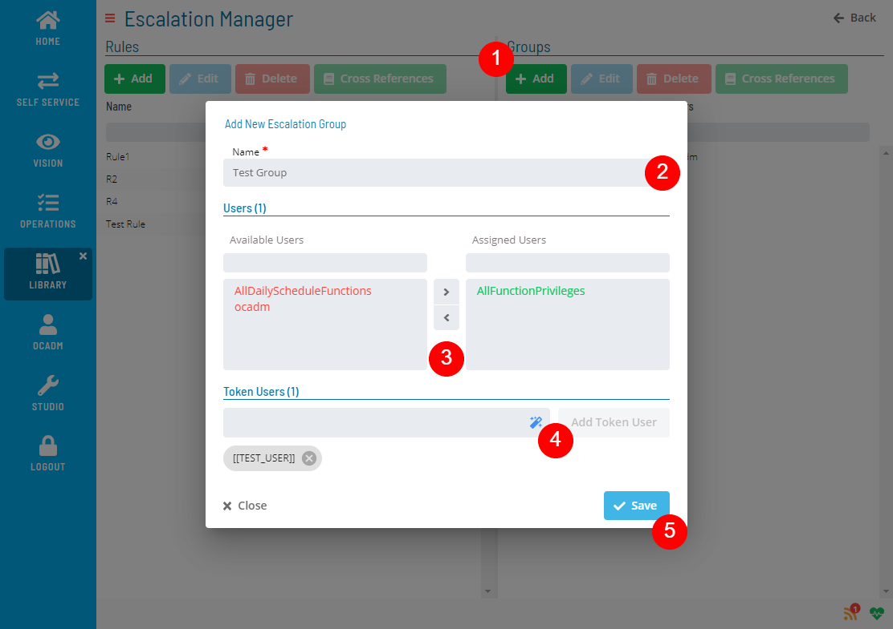
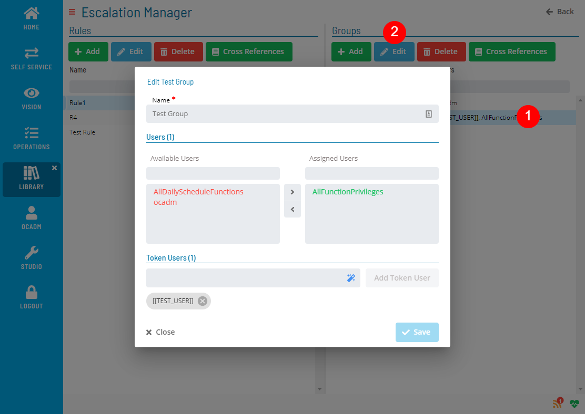
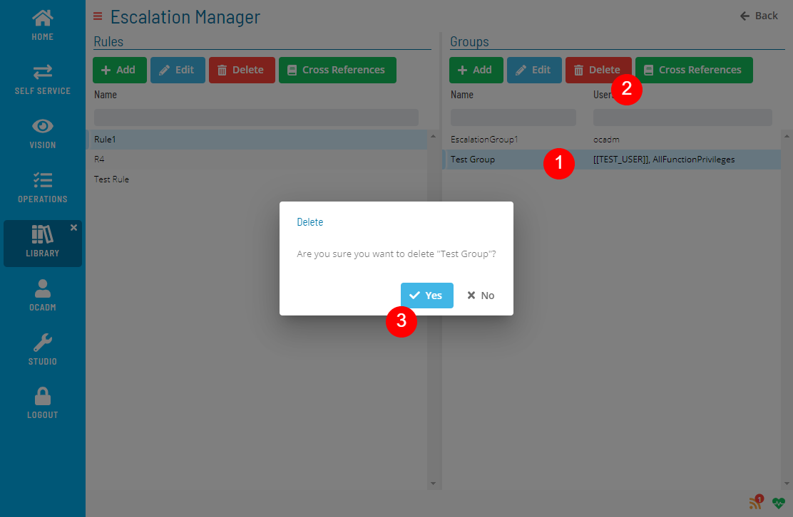
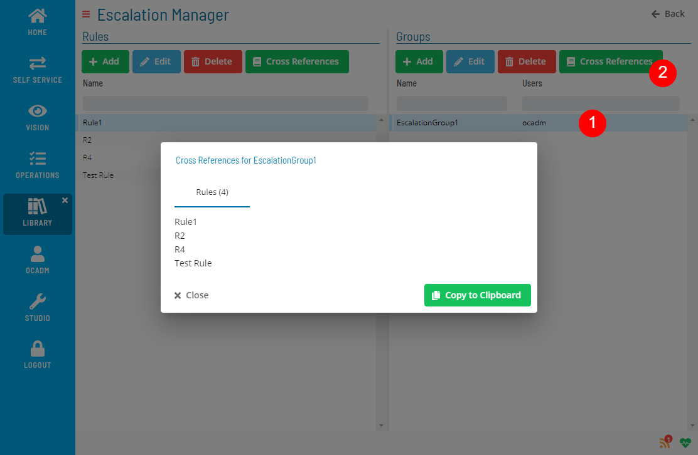

# Managing Escalation Groups

**Theme:** Configure  
**Who Is It For?** System Administrator, Automation Engineer

## What Is It?

Use **Escalation Manager** to add, edit, delete, and check cross-references for escalation groups.

### Creating Escalation Group

Select the Add button above the list and fill out the Escalation Group form.

:::note
Escalation group must have at least one user or token user.
:::

### Editing Escalation Group

Select an Escalation Group, select the Edit button above the list, and fill out the Escalation Group form.

### Deleting Escalation Group

Select an Escalation Group and select the Delete button above the list.

:::note
Delete is not allowed if the Escalation Group has any cross-references.
:::

### Checking Cross References

Select an Escalation Group and select the Cross References button above the list.

.png "More Info icon")
Related Topics

- [Managing Escalation Rules](Managing-Escalation-Rules.md)

## FAQs

**Q: What does managing escalation groups involve?**

Managing escalation groups includes adding, editing, and deleting records. Access escalation groups through the Enterprise Manager navigation pane.

**Q: Who can manage escalation groups in OpCon?**

Users with the appropriate privileges assigned through their role can manage escalation groups. Contact your OpCon system administrator if you do not have access.

## Glossary

**Enterprise Manager (EM)**: OpCon's rich client graphical user interface for Windows and Linux, used to define schedules and jobs, manage automation data, and perform operational tasks.

**Token (Global Property)**: A named value stored in the OpCon database, referenced in job definitions and events using [[PropertyName]] syntax. Tokens pass dynamic values — such as dates, file paths, or counts — into automation workflows.

**Resource**: A numeric variable in OpCon representing a finite pool. Jobs can be configured to require a set number of resource units to run, limiting concurrent executions and preventing resource contention.

**Role**: A named security profile in OpCon that groups privileges together. Roles are assigned to user accounts to control which features, schedules, jobs, machines, and administrative functions a user can access.

**Privilege**: A specific permission granted through an OpCon role that controls access to a feature, function, or object type. Privileges are organized into categories such as Function Privileges, Machine Privileges, Schedule Privileges, and Access Codes.

**OpCon**: Continuous' workflow automation platform. The OpCon server includes the database, SAM and Supporting Services (SAM-SS), and graphical user interfaces. agents installed on target platforms run jobs and report results.
