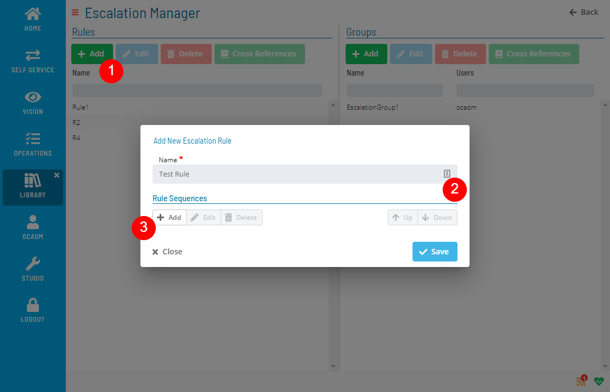
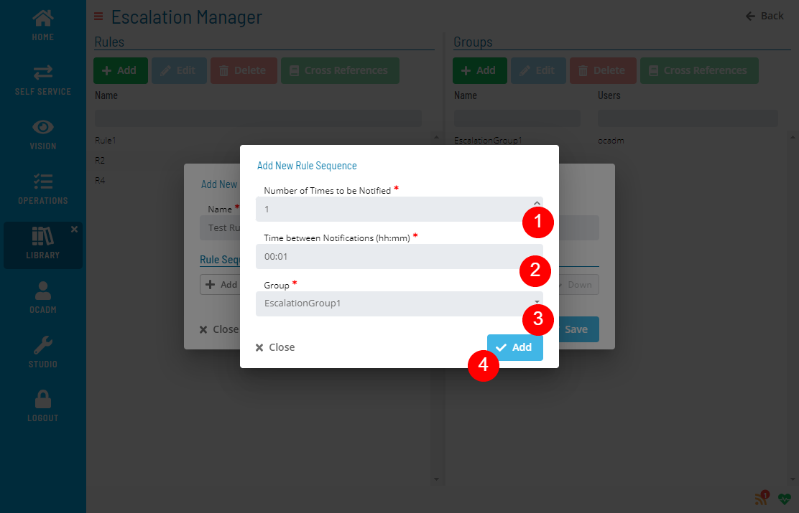
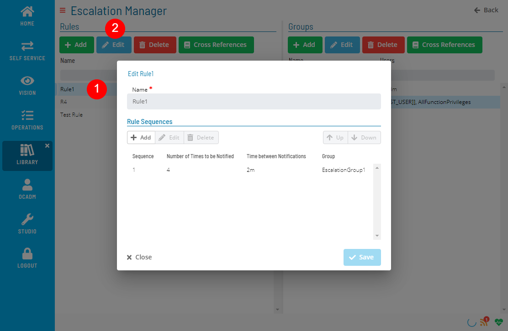
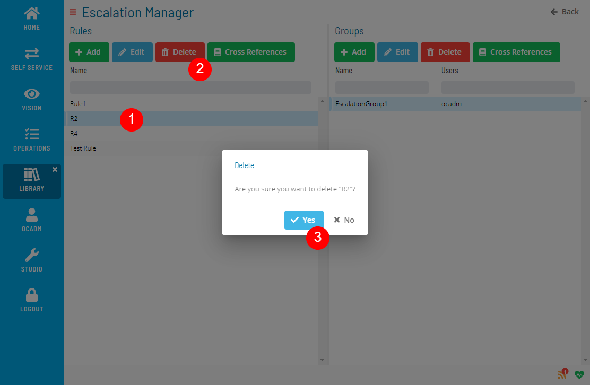
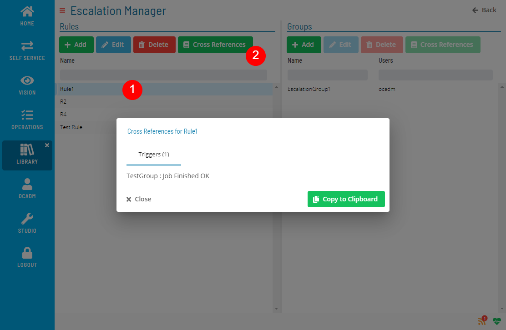

# Managing Escalation Rules

The **Escalation Manager** module allows you to add, edit, delete, and check cross-references for escalation rules.

### Creating Escalation Rule

:::note
At least one Escalation Group must be available before creating a new Escalation Rule.
:::

1. Click the Add button above the list and fill out the Escalation Rule form
   

2. Click the Add Sequence button inside the Rule Sequences section and fill out the Sequence form.
   

   :::note
   You can repeat this step if you need to add more than 1 sequence.
   :::

### Editing Escalation Rule
Select an Escalation Rule and click the Edit button above the list and fill out the Escalation Rule form

### Deleting Escalation Rule

Select an Escalation Rule and click the Delete button above the list

:::note
Delete operation is not allowed if Escalation Rule has any cross-references.
:::

### Checking Cross References

Select an Escalation Rule and click the Cross References button above the list

.png "More Info icon")
Related Topics

- [Managing Escalation Groups](Managing-Escalation-Groups.md)