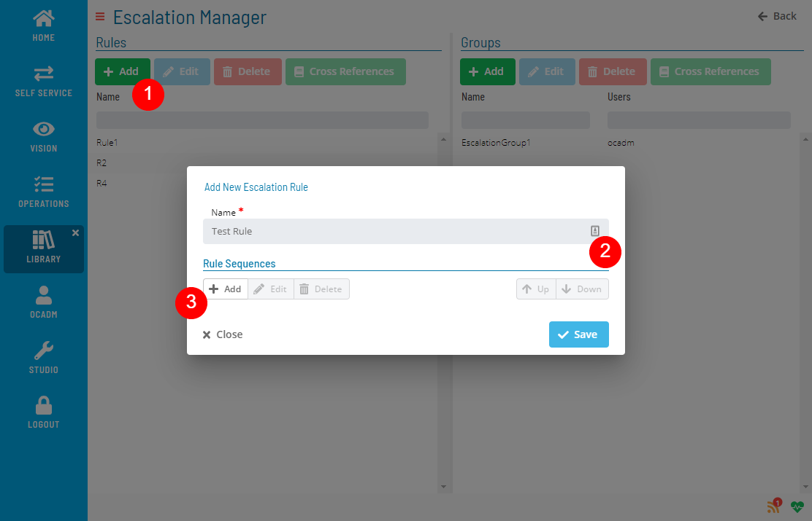
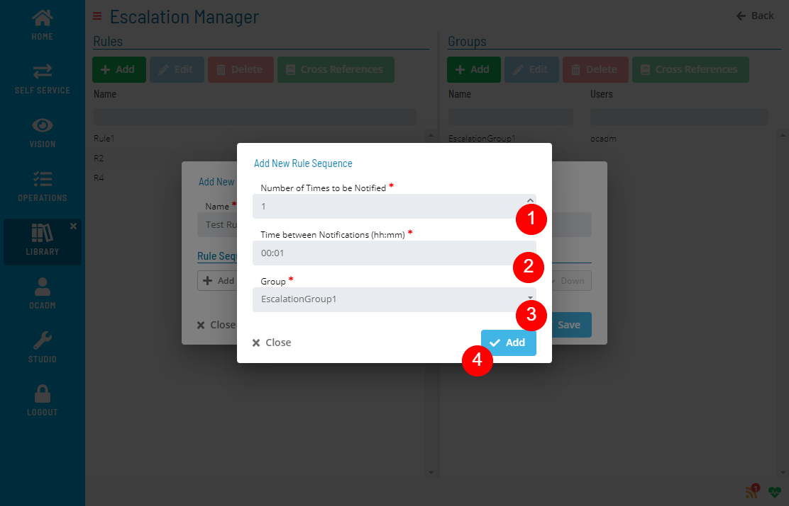
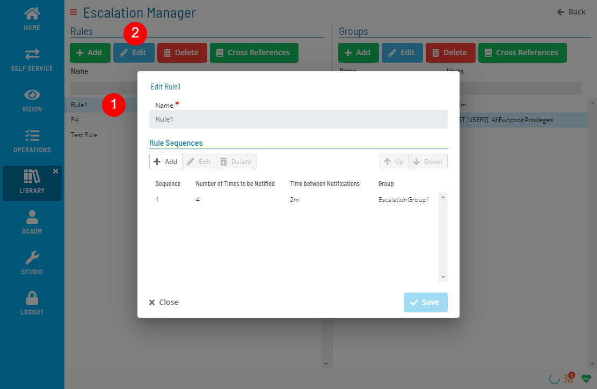
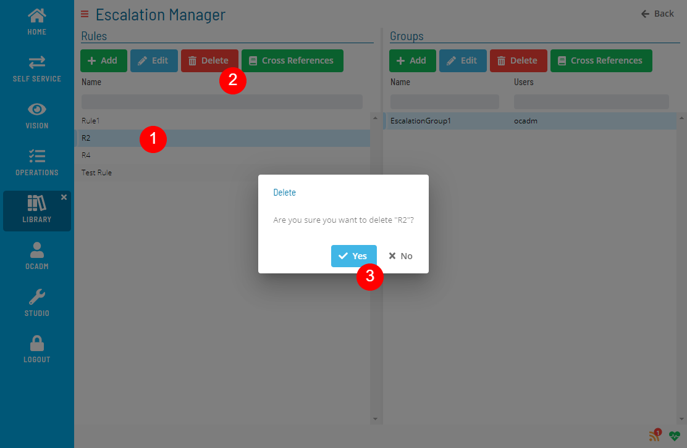
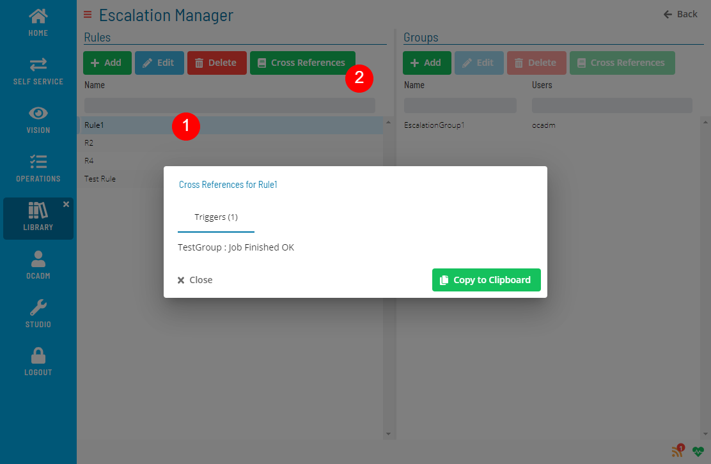

# Managing Escalation Rules

**Theme:** Configure  
**Who Is It For?** System Administrator, Automation Engineer

## What Is It?

Use **Escalation Manager** to add, edit, delete, and check cross-references for escalation rules.

### Creating Escalation Rule

:::note
At least one Escalation Group must exist before creating a new Escalation Rule.
:::

1. Select the Add button above the list and fill out the Escalation Rule form
   

2. Select the Add Sequence button inside the Rule Sequences section and fill out the Sequence form
   

   :::note
   Repeat this step to add more than one sequence.
   :::

### Editing Escalation Rule

Select an Escalation Rule, select the Edit button above the list, and fill out the Escalation Rule form.

### Deleting Escalation Rule

Select an Escalation Rule and select the Delete button above the list.

:::note
Delete is not allowed if the Escalation Rule has any cross-references.
:::

### Checking Cross References

Select an Escalation Rule and select the Cross References button above the list.

.png "More Info icon")
Related Topics

- [Managing Escalation Groups](Managing-Escalation-Groups.md)

## When Would You Use It?

- You need to review or update Escalation Rules settings in Solution Manager
- Escalation Rules needs to be reviewed as part of routine system maintenance or a compliance audit

## Why Would You Use It?

- **Reduce administrative overhead**: Centralizing Escalation Rules management in Solution Manager reduces the time needed to locate and update settings across the environment
- All Escalation Rules changes are captured in the OpCon audit system, supporting change management and compliance processes

## Configuration Options

| Setting | What It Does | Default | Notes |
|---|---|---|---|

## FAQs

**Q: What does managing escalation rules involve?**

Managing escalation rules includes adding, editing, and deleting records. Access escalation rules through the Enterprise Manager navigation pane.

**Q: Who can manage escalation rules in OpCon?**

Users with the appropriate privileges assigned through their role can manage escalation rules. Contact your OpCon system administrator if you do not have access.

## Glossary

**Enterprise Manager (EM)**: OpCon's rich client graphical user interface for Windows and Linux, used to define schedules and jobs, manage automation data, and perform operational tasks.

**Resource**: A numeric variable in OpCon representing a finite pool. Jobs can be configured to require a set number of resource units to run, limiting concurrent executions and preventing resource contention.

**Role**: A named security profile in OpCon that groups privileges together. Roles are assigned to user accounts to control which features, schedules, jobs, machines, and administrative functions a user can access.

**Privilege**: A specific permission granted through an OpCon role that controls access to a feature, function, or object type. Privileges are organized into categories such as Function Privileges, Machine Privileges, Schedule Privileges, and Access Codes.

**OpCon**: Continuous' workflow automation platform. The OpCon server includes the database, SAM and Supporting Services (SAM-SS), and graphical user interfaces. agents installed on target platforms run jobs and report results.
