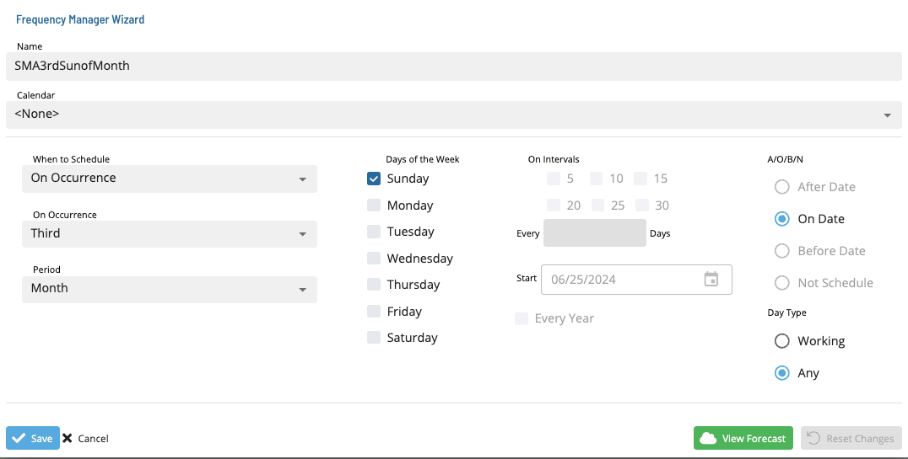

# Editing Frequencies

**Theme:** Configure  
**Who Is It For?** System Administrator, Automation Engineer

## What Is It?

To edit Frequencies in Solution Manager, complete the following steps:

1. Select a frequency and select the **Edit** button. The **Frequency Manager Wizard** dialog displays
2. Make the desired changes to the frequency
3. To preview the changes, select the **Forecast** button
4. To undo the changes, select the **Reset** button
5. Select **Save** to save or **Cancel** to discard

## FAQs

**Q: Do edits to frequencies take effect immediately?**

Changes saved to frequencies in the Job Master take effect the next time the record is built or referenced. Edits to Daily table records apply only to the current instance.

## Glossary

**Daily Tables**: The OpCon database tables that hold the active, date-specific instances of schedules and jobs built for execution. Changes to daily tables affect only the current day's automation.

**Frequency**: A set of rules that defines when a job or schedule is eligible to run, based on calendar rules, day-of-week settings, period offsets, and other timing criteria.

**Resource**: A numeric variable in OpCon representing a finite pool. Jobs can be configured to require a set number of resource units to run, limiting concurrent executions and preventing resource contention.

**Job**: The fundamental unit of work in OpCon. A job defines what to run, on which machine, when to start, and what conditions must be met. Job results are tracked and can trigger events and notifications.
