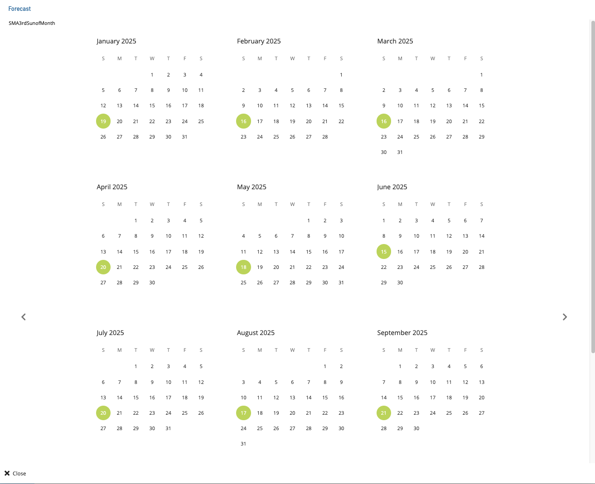

# Forecasting Frequencies

1. Select a frequency and click the **Forecast** button. The **Forecast** dialog displays.
2. The **Forecast** dialog displays the frequency name, and a yearly calendar with included and excluded forecast dates highlighted.
3. Use the **previous** and **next** buttons to navigate through the years.
4. Click **Close** to close the dialog.

