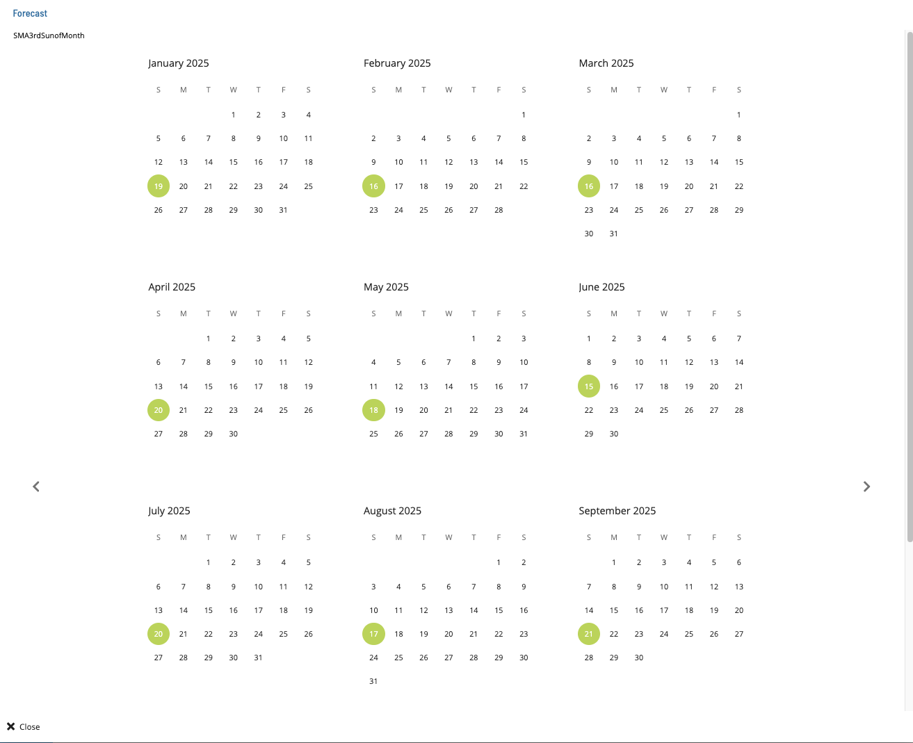

# Forecasting Frequencies

**Theme:** Configure  
**Who Is It For?** System Administrator, Automation Engineer

## What Is It?

To forecast Frequencies in Solution Manager, complete the following steps:

1. Select a frequency and select the **Forecast** button. The **Forecast** dialog displays
2. The dialog shows the frequency name and a yearly calendar with included and excluded dates highlighted
3. Use the **previous** and **next** buttons to navigate through years
4. Select **Close** to close the dialog

## When Would You Use It?

- You need to configure or manage Forecasting Frequencies in OpCon

## Why Would You Use It?

- **Centralized control**: Managing Forecasting Frequencies through OpCon provides consistent oversight and a full audit trail for all changes

## Configuration Options

| Setting | What It Does | Default | Notes |
|---|---|---|---|
## FAQs

**Q: How many steps does the Forecasting Frequencies procedure involve?**

The Forecasting Frequencies procedure involves 4 steps. Complete all steps in order and save your changes.

## Glossary

**Frequency**: A set of rules that defines when a job or schedule is eligible to run, based on calendar rules, day-of-week settings, period offsets, and other timing criteria.

**Calendar**: A named collection of dates in OpCon used by schedules and frequencies to determine when automation runs or is excluded. Calendars can represent holidays, working days, or any custom date set.

**Resource**: A numeric variable in OpCon representing a finite pool. Jobs can be configured to require a set number of resource units to run, limiting concurrent executions and preventing resource contention.
