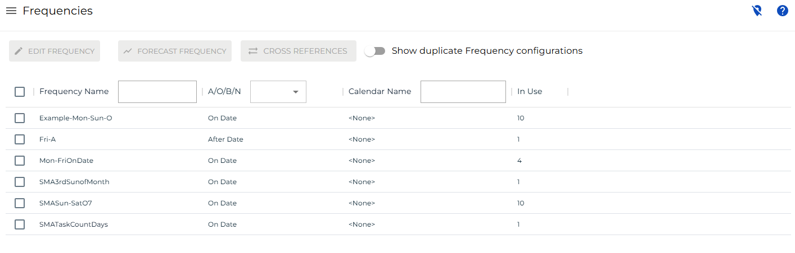

# Managing Frequencies

**Theme:** Configure  
**Who Is It For?** System Administrator, Automation Engineer

## What Is It?

The **Frequencies** page is used to view, edit, and forecast frequencies. It displays a list of existing frequencies with the following options:
- Filter the list by frequency name, A/O/B/N value, calendar name, and in-use count
- View master schedules and jobs that use a frequency by selecting the **Cross References** button in the toolbar
- View frequencies with duplicate configurations by selecting the **Show Duplicate Frequency Configurations** option

For conceptual information, refer to [Frequencies](../../../../../automation-concepts/frequencies.md) in the **Concepts** online help.

Related Topics

- [Editing Frequencies](Editing-Frequencies.md)
- [Forecasting Frequencies](Forecasting-Frequencies.md)

## When Would You Use It?

- You need to review or update Frequencies settings in Solution Manager
- Frequencies needs to be reviewed as part of routine system maintenance or a compliance audit

## Why Would You Use It?

- **Reduce administrative overhead**: Centralizing Frequencies management in Solution Manager reduces the time needed to locate and update settings across the environment
- All Frequencies changes are captured in the OpCon audit system, supporting change management and compliance processes

## FAQs

**Q: What does managing frequencies involve?**

Managing frequencies includes adding, editing, and deleting records. Access frequencies through the Enterprise Manager navigation pane.

**Q: Who can manage frequencies in OpCon?**

Users with the appropriate privileges assigned through their role can manage frequencies. Contact your OpCon system administrator if you do not have access.

## Glossary

**Enterprise Manager (EM)**: OpCon's rich client graphical user interface for Windows and Linux, used to define schedules and jobs, manage automation data, and perform operational tasks.

**Frequency**: A set of rules that defines when a job or schedule is eligible to run, based on calendar rules, day-of-week settings, period offsets, and other timing criteria.

**Calendar**: A named collection of dates in OpCon used by schedules and frequencies to determine when automation runs or is excluded. Calendars can represent holidays, working days, or any custom date set.

**Resource**: A numeric variable in OpCon representing a finite pool. Jobs can be configured to require a set number of resource units to run, limiting concurrent executions and preventing resource contention.

**Role**: A named security profile in OpCon that groups privileges together. Roles are assigned to user accounts to control which features, schedules, jobs, machines, and administrative functions a user can access.

**Privilege**: A specific permission granted through an OpCon role that controls access to a feature, function, or object type. Privileges are organized into categories such as Function Privileges, Machine Privileges, Schedule Privileges, and Access Codes.

**Schedule**: A named container for jobs in OpCon, built for a specific date to create that day's automation. Schedules define build settings, frequencies, and the jobs that run within them.

**Job**: The fundamental unit of work in OpCon. A job defines what to run, on which machine, when to start, and what conditions must be met. Job results are tracked and can trigger events and notifications.
