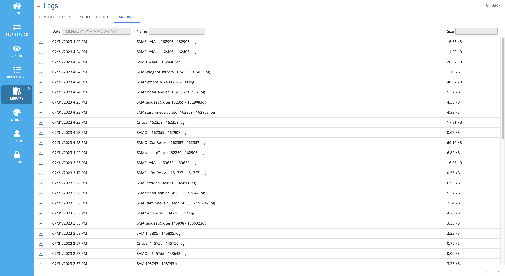

# List Archive Files

**Theme:** Configure  
**Who Is It For?** System Administrator, Automation Engineer

## What Is It?

The **Archives** tab displays archived log files.

### Filtering & Sorting

Filter and sort log files using the column headers. Filter by text in the **Name** or **Size** field (case insensitive), or enter a date range in the **Date** field.

### Log File Details

Select a row to open the Log File Details page.

### Download File

Select the download  button to download a copy of the log file.

## Configuration Options

| Setting | What It Does | Default | Notes |
|---|---|---|---|
## FAQs

**Q: What does List Archive Files do?**

The **Archives** tab displays archived log files.

**Q: Where can you find List Archive Files in OpCon?**

Access List Archive Files through the appropriate section in the Enterprise Manager or Solution Manager navigation.

## Glossary

**Enterprise Manager (EM)**: OpCon's rich client graphical user interface for Windows and Linux, used to define schedules and jobs, manage automation data, and perform operational tasks.

**Solution Manager**: OpCon's browser-based graphical user interface for managing automation data, performing operational actions, and administering the system.

**Resource**: A numeric variable in OpCon representing a finite pool. Jobs can be configured to require a set number of resource units to run, limiting concurrent executions and preventing resource contention.

**OpCon**: Continuous' workflow automation platform. The OpCon server includes the database, SAM and Supporting Services (SAM-SS), and graphical user interfaces. agents installed on target platforms run jobs and report results.
