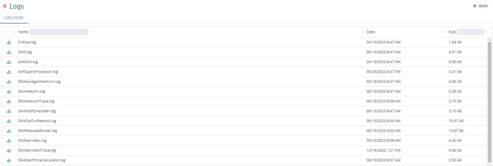

# List Log Files

The **Logs** module allows you to view list of current log files.

### Filtering & Sorting
You can filter and sort log files by using the column headers in the list.

### Log File Information
Mouse over the  icon to see more information about the log file.
