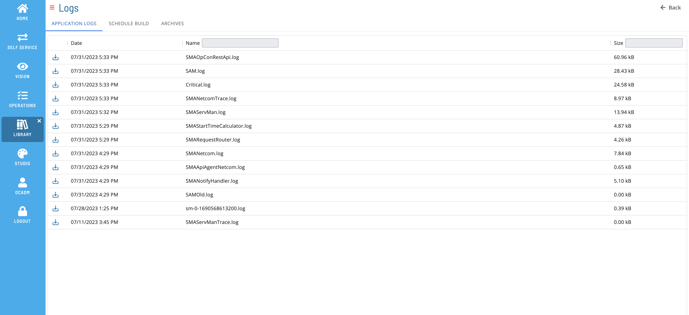

# List Application Logs

The **Application Logs** tab allows you to view list of current log files. User must be a member of a role with a least one of the following privileges to view this tab:

- All Function Privileges
- View Application Logs

### Filtering & Sorting

You can filter and sort log files by using the column headers in the list. You can also filter by entering text in the **Name** or **Size** field, case insensitive.

### Log File Details

Click a row to open the Log File Details Page and see more detailed information about the selected log file.

### Download File

Click the download  button to download a copy of the log file.

### List of collected logs:

The following logs are available in the **Application Logs** tab. This list does not represent all the logs that are available in the application.

- SAM - The SAM Log includes all processing information relating to Schedule and Job starts, Schedule and Job completions, Event processing, etc. The SAM also writes all configuration information to the log when it starts up or when it regenerates.

- Critical - The Critical Log includes all processing errors relating to machine communication failures, database connection problems, event processing failures, license expiration notifications, and so forth.

- Netcom - The SMANetCom Log includes configuration type information relating to configuration parameters, basic communication information and the configuration for each LSAM machine. If the default value for a parameter is changed, the default value will be listed in parentheses next to the relevant parameter.

- NetcomTrace - The SMANetCom will write all processing information into the SMANetComTrace.log. The trace records written to this log will include detailed TCP/IP messages as well as socket connection errors to help with any debugging process.

- ServMan - The SMAServMan Log includes all information relating to the management of all listed applications.

- ServManTrace -

- RequestRouter - The SMARequestRouter Log includes all information relating to request routing.

- SMAOpConRestAPI - Includes all information relating to activity with the OpCon REST API.

- SMAApiAgentNetcom

- SMALsamDataRetriever - The Data Retriever Log captures information related to the requests from the Job Output Retrieval System (JORS).

- NotifyHandler (also referred to as ENS) - The ENS Log or the SMANotifyHandler.log records all information relating to notification processing.

- StartTimeCalculator - The Start Time Calculator will log any recalculated start times for active jobs.

- SMABIRTProcessor.log - Includes information related to general program errors in the SMA Processor handler.

- All of trace logs of SM and SM-API (sm-_.log or sm-api-_.log)
