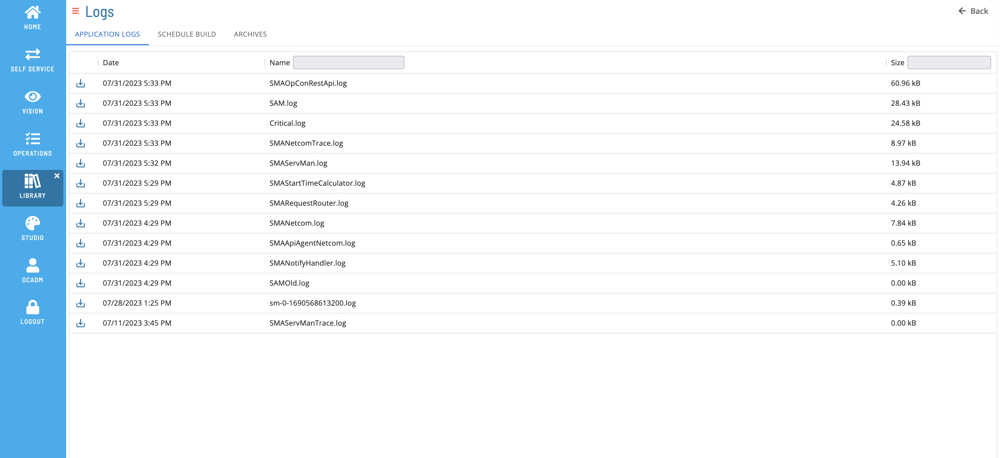

# List Application Logs

**Theme:** Configure  
**Who Is It For?** System Administrator, Automation Engineer

## What Is It?

The **Application Logs** tab displays current log files. To view this tab, you must be a member of a role with at least one of the following privileges:

- All Function Privileges
- View Application Logs

### Filtering & Sorting

Filter and sort log files using the column headers. Filter by text in the **Name** or **Size** field (case insensitive).

### Log File Details

Select a row to open the Log File Details page.

### Download File

Select the download  button to download a copy of the log file.

### List of collected logs:

The following logs are available in the **Application Logs** tab. This list does not represent all available logs.

- **SAM** – Logs Schedule and Job starts, completions, Event processing, and configuration information on startup or regeneration
- **Critical** – Logs processing errors such as machine communication failures, database connection problems, event processing failures, and license expiration notifications
- **Netcom** – Logs configuration parameters, basic communication information, and agent machine configuration. Changed parameters show the default value in parentheses
- **NetcomTrace** – Logs all SMANetCom processing information, including detailed TCP/IP messages and socket connection errors for debugging
- **ServMan** – Logs management information for all listed applications
- **ServManTrace** –
- **RequestRouter** – Logs all request routing information
- **SMAOpConRestAPI** – Logs activity with the OpCon REST API
- **SMAApiAgentNetcom** –
- **SMALsamDataRetriever** – Logs requests from the Job Output Retrieval System (JORS)
- **NotifyHandler (ENS)** – Logs all notification processing (SMANotifyHandler.log)
- **StartTimeCalculator** – Logs recalculated start times for active jobs
- **SMABIRTProcessor.log** – Logs general program errors in the SMA Processor handler
- **SM and SM-API trace logs** (sm-*.log or sm-api-*.log)

## When Would You Use It?

- The **Application Logs** tab displays current log files

## Why Would You Use It?

- **List Application**: The **Application Logs** tab displays current log files

## Configuration Options

| Setting | What It Does | Default | Notes |
|---|---|---|---|
| Critical | Logs processing errors such as machine communication failures, database connection problems, event processing failures, and license expiration notific... | value in parentheses | — |
| Netcom | Logs configuration parameters, basic communication information, and agent machine configuration. | value in parentheses | — |
| NetcomTrace | Logs all SMANetCom processing information, including detailed TCP/IP messages and socket connection errors for debugging | — | — |
| ServMan | Logs management information for all listed applications | — | — |
| RequestRouter | Logs all request routing information | — | — |
| SMAOpConRestAPI | Logs activity with the OpCon REST API | — | — |
| SMALsamDataRetriever | Logs requests from the Job Output Retrieval System (JORS) | — | — |
| NotifyHandler (ENS) | Logs all notification processing (SMANotifyHandler.log) | — | — |
| StartTimeCalculator | Logs recalculated start times for active jobs | — | must be a member of a role with at least one of the following privileges: |
| SMABIRTProcessor.log | Logs general program errors in the SMA Processor handler | — | must be a member of a role with at least one of the following privileges: |
## FAQs

**Q: What does List Application Logs do?**

The **Application Logs** tab displays current log files. To view this tab, you must be a member of a role with at least one of the following privileges:

**Q: Where can you find List Application Logs in OpCon?**

Access List Application Logs through the appropriate section in the Enterprise Manager or Solution Manager navigation.

## Glossary

**JORS (Job Output Retrieval System)**: The system used to retrieve and display job output — logs and reports — from agent machines directly within the OpCon graphical interfaces.

**SMANetCom (SMA Network Communications Module)**: Handles TCP/IP communication of platform-specific automation information between SAM and all agents. Uses database tables to maintain reliable communication and data integrity.

**SAM (Schedule Activity Monitor)**: The logical processor for OpCon workflow automation. SAM monitors schedule and job start times, dependencies, and user commands to determine job execution timing, and processes OpCon events.

**LSAM (Local Schedule Activity Monitor)**: An agent installed on a target platform that runs jobs in the native language of that platform and communicates results back to SAM via SMANetCom over TCP/IP.

**Enterprise Manager (EM)**: OpCon's rich client graphical user interface for Windows and Linux, used to define schedules and jobs, manage automation data, and perform operational tasks.

**Solution Manager**: OpCon's browser-based graphical user interface for managing automation data, performing operational actions, and administering the system.

**TCP/IP**: The network communication protocol used for all data exchange between SMANetCom on the OpCon server and agents on target machines.

**Notification**: A message sent by the SMA Notify Handler when a Machine, Schedule, or Job changes to a specific status. Notifications can be delivered as emails, text messages, Windows Event Log entries, SNMP traps, or other formats.
